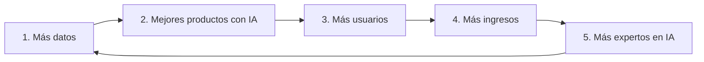
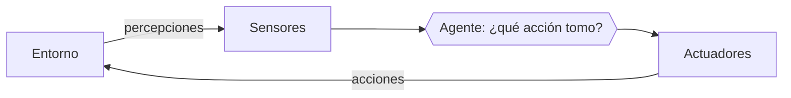

# Capítulo 1. Fundamentos de la IA: de Turing a los LLMs

**Curso:** Introducción a la Inteligencia Artificial (electiva) · Ingeniería de Software – modalidad virtual · UDES
**Semana:** 1 de 8
**Tiempo estimado de lectura:** 90 minutos
**Lecturas base:** García Serrano (2016), cap. 1 · Rouhiainen (2018), cap. 1 · Russell y Norvig (2004), caps. 1 y 2

---

## Objetivos de aprendizaje

Al terminar este capítulo podrás:

1. Explicar qué se entiende por inteligencia artificial (IA) y distinguir los cuatro grandes enfoques para definirla.
2. Describir la prueba de Turing y las capacidades que exige a una máquina.
3. Reconstruir los hitos principales de la historia de la IA, desde los primeros modelos de neurona artificial hasta los modelos de lenguaje de gran escala (LLMs).
4. Diferenciar la IA estrecha (débil), la IA general (fuerte) y la superinteligencia.
5. Definir qué es un agente inteligente y describir su entorno de trabajo con el esquema REAS.
6. Identificar campos de aplicación de la IA, junto con sus beneficios y desafíos.

## ¿Cómo usar este capítulo?

- Lee una sección a la vez. Al final de algunas secciones encontrarás recuadros **«Para pensar»**: detente y responde antes de continuar.
- Los temas que aquí solo se mencionan (búsqueda, razonamiento, aprendizaje automático, redes neuronales, ética) se estudian a fondo en las semanas 2 a 8.
- Cuando el capítulo cita un libro, lo hace con el formato *(Autor, año, capítulo o página)*. La lista completa está en la sección [Referencias](#referencias).
- Al terminar, revisa los [videos y herramientas](../complementos/) y realiza la [práctica de la semana](../practicas/).

---

## Introducción

Cada vez que un teléfono enfoca automáticamente un rostro, que el correo separa el *spam* de los mensajes legítimos o que un asistente responde a una instrucción hablada, hay técnicas de inteligencia artificial trabajando (García Serrano, 2016, prefacio y cap. 1). Aunque hoy la IA parezca una tecnología reciente, el nombre del campo se acuñó en 1956 y sus ideas de base son aún más antiguas (Russell y Norvig, 2004, p. 1).

Este capítulo recorre ese camino. Parte de una pregunta aparentemente sencilla —¿qué es la IA?— y de la propuesta de Alan Turing para responderla, sigue la evolución histórica del campo, presenta el concepto de **agente inteligente**, que será el hilo conductor del curso, y termina con los modelos de lenguaje que hoy escriben texto y código.

---

## 1.1 ¿Qué es la inteligencia artificial?

### 1.1.1 Un problema de definición

Aunque parezca extraño, no existe un consenso entre científicos e ingenieros sobre qué es exactamente la IA, en buena parte porque tampoco hay acuerdo sobre qué es la inteligencia misma. Si los humanos somos inteligentes porque hablamos, resolvemos problemas matemáticos o llegamos a la Luna, ¿qué decir de un perro, que también muestra comportamientos inteligentes? ¿Dónde se traza el límite? (García Serrano, 2016, cap. 1).

A pesar de esta dificultad, podemos partir de algunas definiciones de trabajo:

- **Definición sencilla:** la IA es la habilidad de los ordenadores para hacer actividades que normalmente requieren inteligencia humana (Rouhiainen, 2018, pregunta 1).
- **Definición más detallada:** es la capacidad de las máquinas para usar algoritmos, aprender de los datos y utilizar lo aprendido en la toma de decisiones como lo haría un ser humano, pero sin necesidad de descansar y analizando grandes volúmenes de información a la vez (Rouhiainen, 2018, pregunta 1).
- **Definición pragmática (la que usaremos en el curso):** la IA es un conjunto de técnicas, algoritmos y herramientas que permiten resolver problemas para los que, a priori, se necesita cierto grado de inteligencia, en el sentido de que suponen un desafío incluso para el cerebro humano (García Serrano, 2016, cap. 1).

Rouhiainen (2018, pregunta 1) añade un dato curioso: como el término «inteligencia artificial» incomoda a algunas personas, el experto Sebastian Thrun ha propuesto llamarla «ciencia de datos», una expresión menos intimidante.

### 1.1.2 Cuatro enfoques para entender la IA

Russell y Norvig (2004, pp. 2-5) organizan las definiciones de IA en una tabla de dos dimensiones. La primera pregunta si nos interesa el **pensamiento** (los procesos mentales y el razonamiento) o el **comportamiento** (la conducta). La segunda pregunta si tomamos como modelo al **ser humano** o a un ideal de inteligencia que llaman **racionalidad**: un sistema es racional si hace «lo correcto» en función de lo que sabe.

|  | **Modelo humano** | **Modelo racional** |
|---|---|---|
| **Pensar** | *Sistemas que piensan como humanos.* Enfoque del modelo cognitivo: para decir que un programa piensa como un humano primero hay que saber cómo piensa un humano, lo cual es objeto de la **ciencia cognitiva**. | *Sistemas que piensan racionalmente.* Enfoque de las «leyes del pensamiento»: parte de los silogismos de Aristóteles y de la **lógica**. |
| **Actuar** | *Sistemas que actúan como humanos.* Enfoque de la **prueba de Turing** (sección 1.2). | *Sistemas que actúan racionalmente.* Enfoque del **agente racional** (sección 1.5). |

*Tabla 1.1. Cuatro enfoques de la IA. Elaboración propia a partir de Russell y Norvig (2004, pp. 2-5) y García Serrano (2016, cap. 1).*

Cada enfoque tiene sus límites. Pensar como un humano exige comprender primero el funcionamiento del cerebro, algo que todavía está lejos de lograrse (García Serrano, 2016, cap. 1). El enfoque lógico tropieza con dos obstáculos: no es fácil expresar el conocimiento informal en notación lógica, sobre todo cuando no se tiene certeza total, y hay una gran diferencia entre poder resolver un problema «en principio» y resolverlo en la práctica con recursos de cómputo limitados (Russell y Norvig, 2004, p. 5).

Por eso, el enfoque del **agente racional** es hoy el más aceptado: un agente toma la decisión más conveniente según la información y el tiempo de que dispone. Cuando varios agentes con capacidades distintas colaboran para resolver un problema hablamos de **sistemas multiagente** (García Serrano, 2016, cap. 1).

### 1.1.3 Las grandes ramas: aprender, ver, oír y entender

Dos términos aparecen continuamente al hablar de IA y conviene precisarlos desde el principio (Rouhiainen, 2018, pregunta 1):

- **Aprendizaje automático** (*machine learning*): la capacidad de las máquinas para aprender sin estar programadas explícitamente para cada caso, usando algoritmos que detectan patrones en los datos. Un ejemplo cotidiano es el filtro de *spam* del correo. Tiene tres variantes, que estudiaremos en la semana 6:

  | Tipo | Idea (ejemplo: organizar 10 000 fotos para encontrar las que tienen un gato) |
  |---|---|
  | **Supervisado** | El algoritmo aprende de fotos previamente etiquetadas («gato» / «no gato») y luego clasifica fotos nuevas. Requiere intervención humana para etiquetar. |
  | **No supervisado** | El algoritmo no recibe etiquetas: tiene que encontrar por sí mismo la manera de agrupar las fotos. |
  | **Por refuerzo** | El algoritmo aprende de la experiencia: recibe un «refuerzo positivo» cada vez que acierta, como un perro al que se premia por sentarse. |

- **Aprendizaje profundo** (*deep learning*): un subcampo del aprendizaje automático que usa **redes neuronales** organizadas en muchas capas para reconocer patrones complejos. Requiere grandes cantidades de datos y mucha capacidad de procesamiento, y se usa en reconocimiento de voz, procesamiento del lenguaje natural y visión artificial (semana 7).

Rouhiainen (2018, pregunta 2) resume el avance de estas técnicas en tres capacidades que antes eran exclusivas de los seres humanos: **ver** (visión artificial), **oír** (reconocimiento de voz) y **entender** (procesamiento del lenguaje natural).

> **Para pensar**
> Piensa en tres aplicaciones que usas a diario. ¿Cuál de ellas «ve», cuál «oye» y cuál «entiende»? ¿Alguna aprende de lo que haces?

---

## 1.2 La prueba de Turing

### 1.2.1 El juego de la imitación

El primer intento serio de definir la IA lo hizo el matemático británico **Alan Turing**, considerado el padre de la computación, quien ya había formalizado el modelo de cómputo que seguimos usando hoy mediante su **máquina de Turing** (García Serrano, 2016, cap. 1; Turing, 1937).

En 1950, Turing publicó el artículo *Computing Machinery and Intelligence* (Turing, 1950). En lugar de discutir filosóficamente qué es «pensar», propuso una prueba operacional: una persona se comunica mediante una terminal con una entidad que está en otra habitación y que puede ser un humano o una máquina. Si tras la conversación la persona no logra distinguir si habló con un humano o con una máquina, y era una máquina, podemos considerarla inteligente (García Serrano, 2016, cap. 1; Russell y Norvig, 2004, p. 3).

### 1.2.2 Lo que la prueba exige

La prueba de Turing es valiosa porque exige a la máquina un conjunto de capacidades que, juntas, dibujan el mapa de la IA actual (García Serrano, 2016, cap. 1; Russell y Norvig, 2004, p. 3):

| Capacidad | ¿Qué implica? | Semana del curso |
|---|---|---|
| **Procesamiento del lenguaje natural** | Comprender y construir frases en el idioma humano, con análisis morfológico, sintáctico, semántico y contextual. | 7 |
| **Representación del conocimiento** | Almacenar y recuperar información de forma que pueda usarse para razonar. | 5 |
| **Razonamiento automático** | Llegar a conclusiones a partir de premisas y responder preguntas con la información almacenada. | 2 a 5 |
| **Aprendizaje automático** | Adaptarse a situaciones nuevas y generalizar a partir de ejemplos. | 6 y 7 |

La **prueba de Turing total** (o global) añade una cámara de video y una compuerta por la que se pueden pasar objetos. Para superarla, la máquina necesita además (García Serrano, 2016, cap. 1; Russell y Norvig, 2004, p. 3):

- **Visión artificial**, para interpretar el entorno a partir de imágenes.
- **Robótica**, para manipular y mover objetos.

Según Russell y Norvig (2004, p. 3), estas seis disciplinas abarcan la mayor parte de la IA.

### 1.2.3 Una advertencia de ingeniería

Los propios Russell y Norvig (2004, p. 3) señalan que los investigadores han dedicado poco esfuerzo a que sus sistemas superen la prueba de Turing, porque consideran más importante comprender los principios de la inteligencia que imitar a un ser humano. Lo explican con una analogía: la humanidad logró volar cuando los hermanos Wright, entre otros, dejaron de imitar a los pájaros y comprendieron la aerodinámica. Los textos de ingeniería aeronáutica no se proponen construir máquinas que vuelen tan parecido a las palomas que engañen a otras palomas.

> **Para pensar**
> Hoy existen asistentes conversacionales capaces de mantener diálogos muy fluidos. ¿Crees que eso basta para decir que «piensan»? ¿Qué capacidad de la tabla anterior te parece más difícil de lograr para una máquina?

---

## 1.3 Historia y evolución de la IA

### 1.3.1 Las raíces

Toda ciencia nueva hunde sus raíces en otras más antiguas. El filósofo griego **Aristóteles** intentó codificar la «manera correcta de pensar» con sus **silogismos**, esquemas de argumentación que llevan a conclusiones correctas si se parte de premisas correctas; su estudio dio origen a la **lógica** (Russell y Norvig, 2004, p. 4). El mallorquín **Ramon Llull** ya hablaba en 1315 de máquinas capaces de razonar como las personas (García Serrano, 2016, cap. 1).

### 1.3.2 Génesis (1943-1955)

**Warren McCulloch y Walter Pitts** (1943) son reconocidos como los autores del primer trabajo de IA: propusieron un modelo de neuronas artificiales que se «activan» o no según la estimulación de sus vecinas, y mostraron que redes de estas neuronas podían implementar conectores lógicos como *and*, *or* y *not* (McCulloch y Pitts, 1943; Russell y Norvig, 2004, p. 19). García Serrano (2016, cap. 1) sitúa en este trabajo el pistoletazo de salida de la disciplina.

En 1949, Donald Hebb propuso una regla sencilla para modificar la intensidad de las conexiones entre neuronas, y en 1951 Marvin Minsky y Dean Edmonds construyeron el SNARC, el primer computador basado en una red neuronal, con 3000 válvulas de vacío para simular 40 neuronas (Russell y Norvig, 2004, p. 19). En 1950, Turing articuló en su famoso artículo una visión de la IA que incluía la prueba de Turing, el aprendizaje automático, los algoritmos genéticos y el aprendizaje por refuerzo (Russell y Norvig, 2004, p. 20).

### 1.3.3 El nacimiento oficial (1956)

**John McCarthy**, junto con Marvin Minsky, Nathaniel Rochester y Claude Shannon, firmó en 1955 una propuesta para realizar «un estudio de dos meses y diez personas sobre inteligencia artificial» en el Dartmouth College durante el verano de 1956 (McCarthy et al., 1955). El taller no produjo avances notables, pero reunió a las figuras que dominarían el campo durante veinte años y dejó un consenso: adoptar el nombre propuesto por McCarthy, **Inteligencia Artificial** (Russell y Norvig, 2004, p. 20). Allí destacaron Allen Newell y Herbert Simon con el Teórico Lógico, un programa capaz de demostrar teoremas (Russell y Norvig, 2004, p. 20). McCarthy inventaría después el lenguaje **LISP**, considerado durante décadas el lenguaje de la IA (García Serrano, 2016, cap. 1).

> **Nota de precisión.** García Serrano (2016, cap. 1) afirma que el término fue acuñado en 1958. La fuente primaria —la propuesta firmada por McCarthy et al. el 31 de agosto de 1955 y disponible en línea— confirma que el término ya se usaba en 1955 y que el taller se realizó en 1956, fecha que también dan Russell y Norvig (2004, pp. 1 y 20). Contrastar fuentes es un hábito que te acompañará todo el curso.

### 1.3.4 Grandes esperanzas y una dosis de realidad

Los primeros investigadores hicieron predicciones muy optimistas. En 1957, Herbert Simon anunció que en diez años un computador sería campeón de ajedrez; la predicción se cumplió, pero cuarenta años después y no diez (Russell y Norvig, 2004, p. 24). Los primeros sistemas funcionaban bien en problemas simples, pero fallaban al enfrentarse a problemas más variados o difíciles (Russell y Norvig, 2004, p. 24). El impulso inicial se fue desinflando porque ninguna de las expectativas parecía cumplirse; salvo trabajos aislados, como los primeros algoritmos genéticos a finales de los años 50, pocas universidades seguían invirtiendo en el campo (García Serrano, 2016, cap. 1).

En 1958, Frank Rosenblatt publicó el **perceptrón**, un modelo de neurona artificial capaz de aprender (Rosenblatt, 1958), que estudiaremos en la semana 7.

### 1.3.5 Sistemas expertos y el «invierno» de la IA

A comienzos de los años 80, los **sistemas expertos** —programas que razonan con reglas extraídas de especialistas humanos (semana 5)— reavivaron el interés, sobre todo porque tenían aplicación directa en la industria (García Serrano, 2016, cap. 1). El primero con éxito comercial, R1, comenzó a funcionar en Digital Equipment Corporation y en 1986 le ahorraba unos 40 millones de dólares al año (Russell y Norvig, 2004, p. 28). La industria de la IA pasó de unos pocos millones de dólares en 1980 a miles de millones en 1988, pero poco después llegó la época conocida como **«el invierno de la IA»**, que afectó a las empresas que no lograron cumplir sus extravagantes promesas (Russell y Norvig, 2004, p. 29).

### 1.3.6 El regreso de las redes neuronales y la IA como ciencia

A mediados de los 80, varios grupos reinventaron el algoritmo de **retropropagación**, que permite entrenar redes neuronales con capas ocultas (Russell y Norvig, 2004, p. 29; Rumelhart et al., 1986). García Serrano (2016, cap. 1) ubica aquí el nuevo giro de timón de la disciplina. En los años 90, técnicas como las redes ocultas de Markov, las redes bayesianas y los agentes inteligentes consolidaron la IA como una ciencia apoyada en las matemáticas y la experimentación (García Serrano, 2016, cap. 1; Russell y Norvig, 2004, pp. 29-30).

### 1.3.7 Las máquinas ganan en los juegos

Una forma sencilla de apreciar el progreso de la IA es ver cómo las máquinas han vencido a los mejores jugadores humanos (Rouhiainen, 2018, pregunta 4):

| Año | Hito | Fuente verificable |
|---|---|---|
| 1997 | **Deep Blue** (IBM) vence a Garry Kaspárov en un encuentro a seis partidas, 3,5 a 2,5. En 1996 Deep Blue había ganado una partida, pero Kaspárov ganó aquel primer encuentro 4 a 2. | IBM (s. f.-a) |
| 2011 | **Watson** (IBM) derrota a los dos mayores campeones del concurso *Jeopardy!*. | IBM (s. f.-b) |
| 2016 | **AlphaGo** (DeepMind, Google) vence 4 a 1 a Lee Sedol en Go, en Seúl. | Silver et al. (2016); Google DeepMind (s. f.) |
| 2017 | **Libratus** (Universidad Carnegie Mellon) vence a jugadores profesionales de póquer. | Brown y Sandholm (2018) |
| 2017 | **AlphaGo Zero** aprende Go desde cero, jugando contra sí mismo, sin datos de partidas humanas, y supera a las versiones anteriores de AlphaGo. | Silver et al. (2017) |
| 2018 | **OpenAI Five** vence a equipos humanos aficionados en el videojuego de estrategia en equipo *Dota 2*; entrenaba jugando contra sí mismo el equivalente a 180 años de partidas cada día. | OpenAI (2018) |

*Tabla 1.2. Hitos de la IA en juegos. Elaboración propia a partir de Rouhiainen (2018, pregunta 4) y las fuentes primarias indicadas.*

> **Nota de precisión.** Rouhiainen (2018, introducción y pregunta 4) fecha en 1996 la victoria de Deep Blue sobre Kaspárov. Según IBM (s. f.-a), en 1996 la máquina ganó solo la primera partida y el encuentro completo lo ganó en 1997.

Rouhiainen (2018, pregunta 4) destaca que estos logros no importan por los juegos en sí: las mismas técnicas, como el aprendizaje por refuerzo de AlphaGo Zero, se aplican a problemas reales como la investigación de enfermedades o el diseño de infraestructuras de transporte.

### 1.3.8 Aprendizaje profundo y modelos de lenguaje

La historia más reciente se acelera:

- **2012.** Una red neuronal convolucional profunda entrenada con GPU por Krizhevsky, Sutskever y Hinton logra resultados muy superiores en la clasificación de las imágenes de ImageNet (Krizhevsky et al., 2012).
- **2017.** Vaswani et al. (2017) proponen la arquitectura **Transformer**, basada únicamente en mecanismos de **atención** y no en recurrencia ni convoluciones.
- **2020.** Brown et al. (2020) presentan **GPT-3**, un modelo de lenguaje autorregresivo de 175 000 millones de parámetros, diez veces más que cualquier modelo de lenguaje no disperso anterior.
- **2022.** OpenAI (2022) lanza **ChatGPT** como vista previa de investigación gratuita; es un modelo conversacional entrenado con aprendizaje por refuerzo a partir de retroalimentación humana (RLHF).

La sección 1.7 retoma qué son estos modelos y cómo se conectan con lo que estudiarás en el curso.

### 1.3.9 Línea de tiempo resumida

| Año | Hito |
|---|---|
| 1936-1937 | Turing formaliza la computación con la máquina de Turing (Turing, 1937). |
| 1943 | Primer modelo de neurona artificial (McCulloch y Pitts, 1943). |
| 1950 | *Computing Machinery and Intelligence* y la prueba de Turing (Turing, 1950). |
| 1955-1956 | Propuesta y taller de Dartmouth: nace el nombre «Inteligencia Artificial» (McCarthy et al., 1955). |
| 1958 | Perceptrón de Rosenblatt (Rosenblatt, 1958). |
| Años 60-70 | Grandes promesas, resultados limitados: «una dosis de realidad» (Russell y Norvig, 2004). |
| Años 80 | Auge industrial de los sistemas expertos (García Serrano, 2016; Russell y Norvig, 2004). |
| Finales de los 80 | «El invierno de la IA» (Russell y Norvig, 2004). |
| 1986 | Retropropagación: regresan las redes neuronales (Rumelhart et al., 1986). |
| Años 90 | Redes bayesianas, modelos ocultos de Markov y agentes (García Serrano, 2016). |
| 1997 | Deep Blue vence a Kaspárov (IBM, s. f.-a). |
| 2011 | Watson gana *Jeopardy!* (IBM, s. f.-b). |
| 2012 | Red convolucional profunda en ImageNet (Krizhevsky et al., 2012). |
| 2016-2017 | AlphaGo, AlphaGo Zero y Libratus (Silver et al., 2016, 2017; Brown y Sandholm, 2018). |
| 2017 | Arquitectura Transformer (Vaswani et al., 2017). |
| 2018 | OpenAI Five en *Dota 2* (OpenAI, 2018). |
| 2020 | GPT-3 (Brown et al., 2020). |
| 2022 | Lanzamiento de ChatGPT (OpenAI, 2022). |

> **Para pensar**
> La historia de la IA alterna periodos de entusiasmo y de desencanto. ¿Qué lección puede sacar un ingeniero de software de las promesas incumplidas de los años 60 y de los sistemas expertos de los 80?

---

## 1.4 ¿Por qué la IA avanza tan rápido ahora?

### 1.4.1 Cómputo y datos

Rouhiainen (2018, pregunta 3) identifica dos razones principales del crecimiento actual de la IA:

1. **El poder de procesamiento** de los ordenadores ha crecido exponencialmente, lo que permite ejecutar los algoritmos complejos que mueve la IA.
2. **Los datos**: sin ellos sería casi imposible crear productos y aplicaciones de IA. De ahí la frase «los datos son el nuevo petróleo», atribuida al matemático británico Clive Humby. Importa tanto su volumen como su calidad.

Los datos pueden ser **estructurados** (valores numéricos, fechas, monedas, direcciones) o **no estructurados** (textos, imágenes, videos), mucho más difíciles de analizar. Según una estimación de Merrill Lynch citada por Rouhiainen (2018, pregunta 3), entre el 80 % y el 90 % de los datos de negocios del mundo no están estructurados; el desarrollo de la IA ha permitido por fin aprovecharlos. García Serrano (2016, cap. 1) añade que internet ha sido un buen catalizador: gestionar cantidades ingentes de información, como hacen los buscadores, exige aplicar cierta «inteligencia».

### 1.4.2 El ciclo virtuoso de los datos

Kai-Fu Lee, citado por Rouhiainen (2018, pregunta 3), describe cinco pasos que explican por qué las grandes empresas tecnológicas dependen de los datos:

*Figura 1.1. Ciclo de los datos según Kai-Fu Lee. Elaboración propia a partir de Rouhiainen (2018, pregunta 3).*

### 1.4.3 La cuarta revolución industrial

Klaus Schwab, fundador del Foro Económico Mundial, llamó **cuarta revolución industrial** a la era actual, en la que tecnologías como la IA, la impresión 3D, la robótica, el internet de las cosas, los vehículos autónomos, la nanotecnología y la computación cuántica se combinan entre sí (Rouhiainen, 2018, pregunta 6). Rouhiainen sostiene que la IA está en el centro de este fenómeno y recuerda la frase de Andrew Ng: «la inteligencia artificial es la nueva electricidad» (Rouhiainen, 2018, preguntas 5 y 6).

---

## 1.5 Niveles de IA: estrecha, general y superinteligencia

Mucho del debate público sobre la IA se centra en cuándo será tan inteligente como un humano o si llegará a superarlo. Para ordenar esa discusión, Rouhiainen (2018, pregunta 10) distingue tres niveles:

| Nivel | Descripción | Estado |
|---|---|---|
| **IA estrecha o débil** | Resuelve una sola tarea (recomendar productos, ordenar noticias, conducir un vehículo), pero no puede manejar múltiples ámbitos simultáneamente y carece de inteligencia de tipo humano. | Es la IA que usamos actualmente. |
| **IA general o fuerte** | Realizaría tareas en todos los ámbitos de manera hábil y flexible, con una inteligencia comparable a la mente humana. | No se ha logrado. Los expertos discrepan sobre cuándo llegará; algunos, como Peter Norvig, creen que nunca se conseguirá. |
| **Superinteligencia artificial** | Según Nick Bostrom, una IA significativamente más inteligente que los humanos en prácticamente todos los campos. | Hipotética. |

*Tabla 1.3. Niveles de IA. Elaboración propia a partir de Rouhiainen (2018, pregunta 10).*

Ten en cuenta que los términos «débil» y «fuerte» también se usan en filosofía con otro sentido. Russell y Norvig (2004, cap. 26) llaman **IA débil** a la pregunta de si las máquinas pueden *actuar* con inteligencia, e **IA fuerte** a la pregunta de si pueden *pensar de verdad*. Al leer un texto, fíjate en cuál de los dos sentidos usa el autor.

Los modelos de lenguaje actuales realizan una variedad de tareas mucho mayor que los ejemplos de IA estrecha que Rouhiainen tenía en mente en 2018, y eso ha reavivado la discusión sobre la IA general. Retomaremos este debate en la semana 8; por ahora, el video complementario *¿Qué es la AGI?* (DotCSV) te dará un primer panorama.

---

## 1.6 Agentes inteligentes

El concepto de agente es el hilo conductor de este curso: casi todos los algoritmos que estudiarás se pueden ver como la forma en que un agente decide qué hacer.

### 1.6.1 ¿Qué es un agente?

Un **agente** es cualquier cosa capaz de percibir su entorno con la ayuda de **sensores** y actuar en ese entorno utilizando **actuadores** (Russell y Norvig, 2004, p. 37). Un agente humano percibe con ojos y oídos y actúa con manos, piernas y boca; un agente de software percibe pulsaciones de teclado, archivos o paquetes de red y actúa mostrando mensajes, escribiendo archivos o enviando paquetes (Russell y Norvig, 2004, p. 38).

*Figura 1.2. Un agente interactúa con su entorno mediante sensores y actuadores. Elaboración propia a partir de Russell y Norvig (2004, fig. 2.1).*

Tres conceptos precisan esta idea (Russell y Norvig, 2004, pp. 38-39):

- **Secuencia de percepciones:** el historial completo de lo que el agente ha percibido.
- **Función del agente:** la descripción matemática abstracta que asigna una acción a cada secuencia de percepciones.
- **Programa del agente:** la implementación concreta de esa función, que se ejecuta sobre una arquitectura física. Como ingenieros de software, lo que construimos son programas de agentes.

### 1.6.2 El agente racional

Un **agente racional** es el que actúa con la intención de alcanzar el mejor resultado o, cuando hay incertidumbre, el mejor resultado esperado (Russell y Norvig, 2004, p. 5). La racionalidad en un momento dado depende de cuatro factores (Russell y Norvig, 2004, p. 41):

1. La **medida de rendimiento** que define el criterio de éxito.
2. El **conocimiento del entorno** que ha acumulado el agente.
3. Las **acciones** que el agente puede llevar a cabo.
4. La **secuencia de percepciones** hasta ese momento.

Observa que ser racional no es lo mismo que razonar siempre: retirar la mano de una estufa caliente es un acto reflejo racional y más eficiente que una deliberación cuidadosa (Russell y Norvig, 2004, p. 5).

### 1.6.3 El entorno de trabajo: el esquema REAS

Antes de diseñar un agente hay que especificar su **entorno de trabajo** de la forma más completa posible. Russell y Norvig (2004, p. 44) usan el acrónimo **REAS**: **R**endimiento, **E**ntorno, **A**ctuadores y **S**ensores (en inglés, PEAS). Su ejemplo clásico es un taxi automático:

| Componente | Taxi automático |
|---|---|
| **Rendimiento** | Viaje seguro, rápido, legal y confortable; maximizar el beneficio. |
| **Entorno** | Carreteras, otro tráfico, peatones, clientes. |
| **Actuadores** | Dirección, acelerador, freno, señales, bocina, pantalla. |
| **Sensores** | Cámaras, sónar, velocímetro, GPS, tacómetro, sensores del motor, teclado. |

*Tabla 1.4. Descripción REAS de un taxi automático (Russell y Norvig, 2004, p. 45, fig. 2.4).*

**Ejemplo para practicar (elaboración propia).** Un asistente conversacional de soporte técnico para una universidad podría describirse así: *rendimiento*, porcentaje de consultas resueltas sin intervención humana y satisfacción del usuario; *entorno*, estudiantes, sistema de matrícula y base de preguntas frecuentes; *actuadores*, mensajes de texto y creación de tickets; *sensores*, los mensajes escritos por los usuarios.

### 1.6.4 Propiedades del entorno

El tipo de entorno condiciona el diseño del agente. Russell y Norvig (2004, pp. 47-49) proponen estas dimensiones:

| Dimensión | Pregunta clave | Ejemplo |
|---|---|---|
| **Totalmente observable** vs. **parcialmente observable** | ¿Los sensores dan acceso a todo lo relevante del entorno? | Un taxi no puede saber qué piensan los otros conductores: parcialmente observable. |
| **Determinista** vs. **estocástico** | ¿El siguiente estado depende solo del estado actual y de la acción del agente? | El tráfico no se puede predecir con exactitud: estocástico. |
| **Episódico** vs. **secuencial** | ¿Cada decisión es independiente de las anteriores? | Clasificar piezas defectuosas es episódico; el ajedrez es secuencial. |
| **Estático** vs. **dinámico** | ¿Puede cambiar el entorno mientras el agente delibera? | Un crucigrama es estático; la conducción es dinámica. |
| **Discreto** vs. **continuo** | ¿El número de estados, percepciones y acciones es finito? | El ajedrez es discreto; la conducción es continua. |
| **Individual** vs. **multiagente** | ¿Hay otros agentes que influyen en el resultado? | Resolver un crucigrama solo es individual; el ajedrez es multiagente. |

*Tabla 1.5. Propiedades de los entornos de trabajo. Elaboración propia a partir de Russell y Norvig (2004, pp. 47-49).*

### 1.6.5 Tipos de agentes

Russell y Norvig (2004, pp. 53-60) describen cuatro tipos básicos de programas de agente, más una forma de hacer que cualquiera de ellos aprenda:

1. **Agentes reactivos simples:** eligen la acción según la percepción *actual*, con reglas de condición-acción. Por ejemplo: *si el coche de adelante está frenando, entonces iniciar el frenado*.
2. **Agentes reactivos basados en modelos:** mantienen un **estado interno** con información sobre las partes del mundo que no pueden ver en ese momento.
3. **Agentes basados en objetivos:** además del estado actual, conocen una **meta** que describe las situaciones deseables, por ejemplo, llegar al destino del pasajero. Aquí entran los algoritmos de búsqueda de las semanas 2 y 3.
4. **Agentes basados en utilidad:** no basta con llegar a la meta; hay caminos más rápidos, seguros o baratos que otros. Una **función de utilidad** asigna a cada estado un número que indica qué tan preferible es.
5. **Agentes que aprenden:** el propio Turing (1950) consideró que programar máquinas inteligentes a mano sería demasiado lento y propuso construir máquinas que aprendan y luego enseñarles (Russell y Norvig, 2004, pp. 59-60). En muchas áreas de la IA, este es hoy el método más adecuado.

> **Para pensar**
> Elige una aplicación que uses (un GPS, un filtro de *spam*, un asistente de voz). Descríbela con el esquema REAS e indica qué tipo de agente crees que es.

---

## 1.7 Campos de aplicación de la IA

### 1.7.1 Técnicas en crecimiento

Rouhiainen (2018, pregunta 1) enumera aplicaciones técnicas de la IA que crecen rápidamente: el reconocimiento, clasificación y etiquetado de imágenes; las estrategias algorítmicas en el comercio financiero; el procesamiento de datos de pacientes; el mantenimiento predictivo; la detección de objetos en vehículos autónomos; la distribución de contenido en redes sociales; y la protección contra amenazas de ciberseguridad.

### 1.7.2 La IA por sectores

El capítulo 2 de Rouhiainen (2018) describe cómo la IA transforma diez sectores. Algunos ejemplos que ofrece el autor (con cifras de la época de publicación del libro):

| Sector | Ejemplo según Rouhiainen (2018, cap. 2) |
|---|---|
| **Finanzas** | JP Morgan Chase introdujo un programa de aprendizaje automático que revisa acuerdos de préstamo y eliminó más de 360 000 horas de trabajo anual de abogados. |
| **Turismo** | Finnair probó el reconocimiento facial en el aeropuerto de Helsinki para que los pasajeros se registren sin tarjeta de embarque física. |
| **Salud** | En una prueba con 1000 diagnósticos de cáncer, los tratamientos recomendados por IBM Watson coincidieron en el 99 % de los casos con los del oncólogo. |
| **Comercio** | Amazon abrió en 2016 una tienda sin cajeros, donde los productos se cobran automáticamente a la cuenta del cliente. |
| **Periodismo** | La generación de lenguaje natural transforma datos en artículos legibles. |
| **Educación** | Plataformas y tutores personalizados que adaptan el curso al conocimiento previo de cada estudiante. |
| **Agricultura** | Drones que monitorizan cultivos y tractores autónomos. |
| **Entretenimiento** | Watson de IBM produjo el tráiler de la película *Morgan*. |
| **Gobierno** | Software como PredPol predice zonas y franjas horarias con más probabilidad de delitos, aunque algunos expertos advierten que puede aumentar la discriminación contra minorías. |

*Tabla 1.6. Ejemplos de aplicación de la IA por sectores (Rouhiainen, 2018, cap. 2).*

### 1.7.3 La IA en la vida cotidiana

García Serrano (2016, cap. 1) destaca que la IA está cada vez más presente en nuestro día a día, a veces sin que lo notemos: el buscador de Google aprende de los clics de los usuarios para mejorar sus resultados; los filtros antispam usan clasificadores bayesianos (semana 6); los teléfonos inteligentes incorporan reconocimiento facial y asistentes de voz; la industria automotriz desarrolla vehículos autónomos; miles de empresas usan sistemas de planificación para organizar sus repartos; y en juegos como el ajedrez ya nadie pone en duda la supremacía de las máquinas.

### 1.7.4 Beneficios y desafíos

Toda tecnología tiene dos caras. Rouhiainen (2018, pregunta 7) propone una visión integral:

| Beneficios potenciales | Desafíos |
|---|---|
| Salvar vidas y descubrir curas en salud | Cambios en el mercado laboral y necesidad de reeducación |
| Combatir la pobreza extrema | Posible aumento de la soledad y el aislamiento |
| Educación personalizada | Necesidad de pautas éticas |
| Tareas peligrosas o tediosas a cargo de máquinas | Uso en propaganda política |
| Vehículos autónomos más seguros | Desigualdad geopolítica |
| Oportunidades de negocio y mayor productividad | Temor y exageración publicitaria |
| Mejora de procesos e industrias | Uso de la IA como arma |

*Tabla 1.7. Ventajas y desventajas de la IA (Rouhiainen, 2018, pregunta 7).*

Estos temas se profundizan en la semana 8. Como referencia, los **Principios de Asilomar**, desarrollados en 2017 en una conferencia coordinada por el Future of Life Institute, proponen, entre otras cosas, que los sistemas de IA sean seguros durante toda su vida operativa (Future of Life Institute, 2017).

---

## 1.8 Hacia los LLMs: la etapa más reciente

El título de este capítulo, «de Turing a los LLMs», une el primer intento de definir la IA con su etapa más visible hoy: los **modelos de lenguaje de gran escala** (*Large Language Models*, LLMs).

Un modelo de lenguaje como GPT-3 es, en palabras de sus autores, un **modelo de lenguaje autorregresivo** (Brown et al., 2020): genera texto de manera secuencial, produciendo cada nuevo fragmento a partir de lo que ya se ha escrito. Estos modelos se construyen sobre la arquitectura **Transformer** (Vaswani et al., 2017) y se entrenan con enormes cantidades de texto.

Lo interesante para este curso es que un LLM no es una idea aislada. Reúne varios de los elementos que ya presentamos:

- Es una **red neuronal profunda** (sección 1.1.3), heredera de la neurona de McCulloch y Pitts y del perceptrón (sección 1.3).
- Se entrena con **grandes volúmenes de datos no estructurados** y mucho **poder de cómputo** (sección 1.4).
- Asistentes como ChatGPT se afinan con **aprendizaje por refuerzo** a partir de retroalimentación humana (OpenAI, 2022), el mismo tipo de aprendizaje que usó AlphaGo Zero (sección 1.3.7).
- Conversan en **lenguaje natural**, la primera capacidad que exigía la prueba de Turing (sección 1.2).

En la semana 7 veremos con más detalle cómo funcionan las redes neuronales y el procesamiento del lenguaje natural, y en la semana 8 analizaremos sus limitaciones y riesgos.

> **Para pensar**
> Si un LLM genera texto que suena convincente, ¿significa eso que lo que dice es verdadero? Guarda tu respuesta: la retomaremos en la semana 8.

---

## Resumen

- No existe una definición única de IA. En este curso la entendemos como un conjunto de técnicas, algoritmos y herramientas para resolver problemas que requieren cierto grado de inteligencia.
- Las definiciones de IA se organizan en cuatro enfoques: pensar como humanos, pensar racionalmente, actuar como humanos (prueba de Turing) y actuar racionalmente (agentes). Este último es el más aceptado hoy.
- La prueba de Turing (1950) exige procesamiento del lenguaje natural, representación del conocimiento, razonamiento y aprendizaje; la versión total añade visión y robótica.
- La IA nació oficialmente en Dartmouth (1956) y ha alternado periodos de entusiasmo y de desencanto.
- El auge actual se explica por el crecimiento del poder de cómputo y la disponibilidad de datos.
- Toda la IA que usamos hoy es IA estrecha; la IA general y la superinteligencia no existen todavía.
- Un agente percibe su entorno con sensores y actúa con actuadores; su diseño parte de especificar el entorno de trabajo con el esquema REAS.
- La IA se aplica en prácticamente todos los sectores y trae beneficios y desafíos que un ingeniero de software debe conocer.
- Los LLMs combinan redes neuronales profundas, grandes datos, gran capacidad de cómputo y aprendizaje por refuerzo.

## Glosario

| Término | Definición |
|---|---|
| **Actuador** | Elemento con el que un agente actúa sobre su entorno. |
| **Agente** | Cualquier cosa capaz de percibir su entorno mediante sensores y actuar sobre él mediante actuadores. |
| **Agente racional** | Agente que actúa para alcanzar el mejor resultado, o el mejor resultado esperado cuando hay incertidumbre. |
| **Aprendizaje automático** | Capacidad de las máquinas para aprender a partir de datos sin estar programadas explícitamente para cada caso. |
| **Aprendizaje profundo** | Subcampo del aprendizaje automático que usa redes neuronales de muchas capas. |
| **Algoritmo** | Método paso a paso que usa un ordenador para completar una tarea. |
| **Datos no estructurados** | Datos difíciles de analizar, como textos, imágenes y videos. |
| **IA estrecha (débil)** | IA útil para una sola tarea, sin inteligencia de tipo humano. |
| **IA general (fuerte)** | IA hipotética capaz de realizar tareas en todos los ámbitos, comparable a la mente humana. |
| **LLM** | Modelo de lenguaje de gran escala, entrenado con enormes cantidades de texto. |
| **Prueba de Turing** | Prueba propuesta por Turing (1950) en la que una persona intenta distinguir si conversa con un humano o con una máquina. |
| **REAS** | Rendimiento, Entorno, Actuadores y Sensores: esquema para especificar el entorno de trabajo de un agente. |
| **Sensor** | Elemento con el que un agente percibe su entorno. |
| **Sistema experto** | Sistema que toma decisiones como un experto humano, basado en reglas del tipo *si… entonces*. |
| **Sistema multiagente** | Conjunto de agentes que colaboran para resolver un problema. |
| **Superinteligencia** | IA hipotética significativamente más inteligente que los humanos en prácticamente todos los campos. |
| **Transformer** | Arquitectura de red neuronal basada en mecanismos de atención, base de los LLMs actuales. |

*Algunas definiciones se basan en los términos clave de Rouhiainen (2018, pregunta 10).*

## Preguntas de repaso

1. ¿Por qué es difícil dar una definición única de inteligencia artificial?
2. Explica con un ejemplo propio la diferencia entre «actuar como un humano» y «actuar racionalmente».
3. ¿Qué capacidades debe tener una máquina para superar la prueba de Turing? ¿Y la prueba de Turing total?
4. ¿Por qué Russell y Norvig consideran que imitar a un humano no es el objetivo principal de la IA? Explica la analogía de los hermanos Wright.
5. ¿Qué ocurrió en Dartmouth en 1956 y por qué se considera el nacimiento de la IA?
6. Menciona una causa del «invierno de la IA» y dos factores que explican el auge actual.
7. ¿Cuál es la diferencia entre aprendizaje supervisado, no supervisado y por refuerzo?
8. Diferencia la IA estrecha, la IA general y la superinteligencia. ¿En qué nivel está la IA que usamos hoy?
9. Describe con el esquema REAS un agente de tu elección y clasifica su entorno según las seis dimensiones de la tabla 1.5.
10. ¿Qué elementos de la historia de la IA se combinan en un LLM?

---

## Referencias

Brown, N., y Sandholm, T. (2018). Superhuman AI for heads-up no-limit poker: Libratus beats top professionals. *Science, 359*(6374), 418-424. https://doi.org/10.1126/science.aao1733

Brown, T. B., Mann, B., Ryder, N., Subbiah, M., Kaplan, J., Dhariwal, P., Neelakantan, A., Shyam, P., Sastry, G., Askell, A., Agarwal, S., Herbert-Voss, A., Krueger, G., Henighan, T., Child, R., Ramesh, A., Ziegler, D. M., Wu, J., Winter, C., … Amodei, D. (2020). *Language models are few-shot learners* [Preimpresión]. arXiv. https://arxiv.org/abs/2005.14165

Future of Life Institute. (2017). *Asilomar AI principles*. https://futureoflife.org/open-letter/ai-principles/

García Serrano, A. (2016). *Inteligencia artificial: Fundamentos, práctica y aplicaciones* (2.ª ed.). RC Libros.

Google DeepMind. (s. f.). *AlphaGo*. https://deepmind.google/research/breakthroughs/alphago/

IBM. (s. f.-a). *Deep Blue*. https://www.ibm.com/history/deep-blue

IBM. (s. f.-b). *Watson, 'Jeopardy!' champion*. https://www.ibm.com/history/watson-jeopardy

Krizhevsky, A., Sutskever, I., y Hinton, G. E. (2012). ImageNet classification with deep convolutional neural networks. *Advances in Neural Information Processing Systems, 25*. https://papers.nips.cc/paper/4824-imagenet-classification-with-deep-convolutional-neural-networks

McCarthy, J., Minsky, M. L., Rochester, N., y Shannon, C. E. (1955). *A proposal for the Dartmouth summer research project on artificial intelligence*. http://jmc.stanford.edu/articles/dartmouth/dartmouth.pdf

McCulloch, W. S., y Pitts, W. (1943). A logical calculus of the ideas immanent in nervous activity. *The Bulletin of Mathematical Biophysics, 5*, 115-133. https://doi.org/10.1007/BF02478259

OpenAI. (2018, 25 de junio). *OpenAI Five*. https://openai.com/index/openai-five/

OpenAI. (2022, 30 de noviembre). *Introducing ChatGPT*. https://openai.com/index/chatgpt/

Rosenblatt, F. (1958). The perceptron: A probabilistic model for information storage and organization in the brain. *Psychological Review, 65*(6), 386-408. https://doi.org/10.1037/h0042519

Rouhiainen, L. (2018). *Inteligencia artificial: 101 cosas que debes saber hoy sobre nuestro futuro*. Alienta Editorial.

Rumelhart, D. E., Hinton, G. E., y Williams, R. J. (1986). Learning representations by back-propagating errors. *Nature, 323*, 533-536. https://doi.org/10.1038/323533a0

Russell, S. J., y Norvig, P. (2004). *Inteligencia artificial: Un enfoque moderno* (2.ª ed.; J. M. Corchado Rodríguez et al., Trads.). Pearson Educación.

Silver, D., Huang, A., Maddison, C. J., Guez, A., Sifre, L., van den Driessche, G., Schrittwieser, J., Antonoglou, I., Panneershelvam, V., Lanctot, M., Dieleman, S., Grewe, D., Nham, J., Kalchbrenner, N., Sutskever, I., Lillicrap, T., Leach, M., Kavukcuoglu, K., Graepel, T., y Hassabis, D. (2016). Mastering the game of Go with deep neural networks and tree search. *Nature, 529*, 484-489. https://doi.org/10.1038/nature16961

Silver, D., Schrittwieser, J., Simonyan, K., Antonoglou, I., Huang, A., Guez, A., Hubert, T., Baker, L., Lai, M., Bolton, A., Chen, Y., Lillicrap, T., Hui, F., Sifre, L., van den Driessche, G., Graepel, T., y Hassabis, D. (2017). Mastering the game of Go without human knowledge. *Nature, 550*, 354-359. https://doi.org/10.1038/nature24270

Turing, A. M. (1937). On computable numbers, with an application to the Entscheidungsproblem. *Proceedings of the London Mathematical Society, s2-42*(1), 230-265. https://doi.org/10.1112/plms/s2-42.1.230

Turing, A. M. (1950). Computing machinery and intelligence. *Mind, 59*(236), 433-460. https://doi.org/10.1093/mind/LIX.236.433

Vaswani, A., Shazeer, N., Parmar, N., Uszkoreit, J., Jones, L., Gomez, A. N., Kaiser, Ł., y Polosukhin, I. (2017). *Attention is all you need* [Preimpresión]. arXiv. https://arxiv.org/abs/1706.03762
