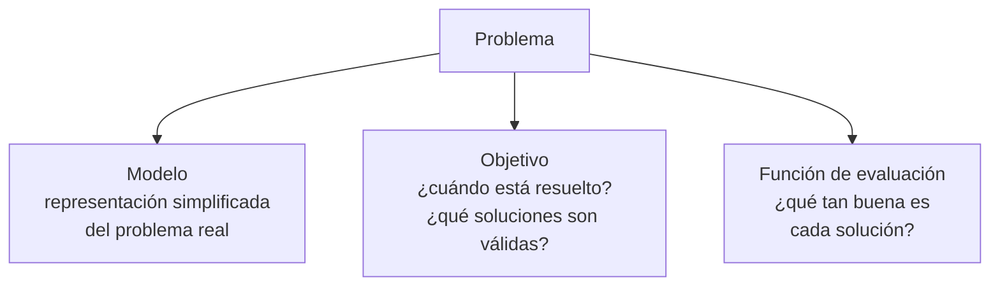
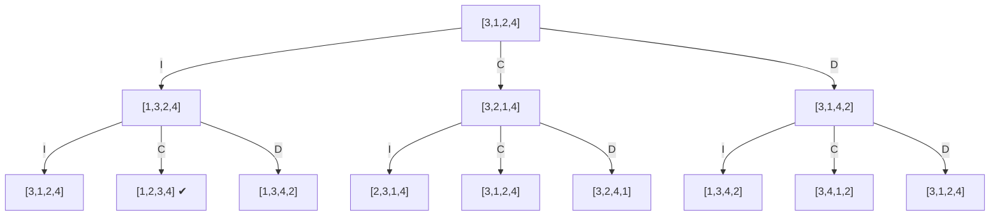
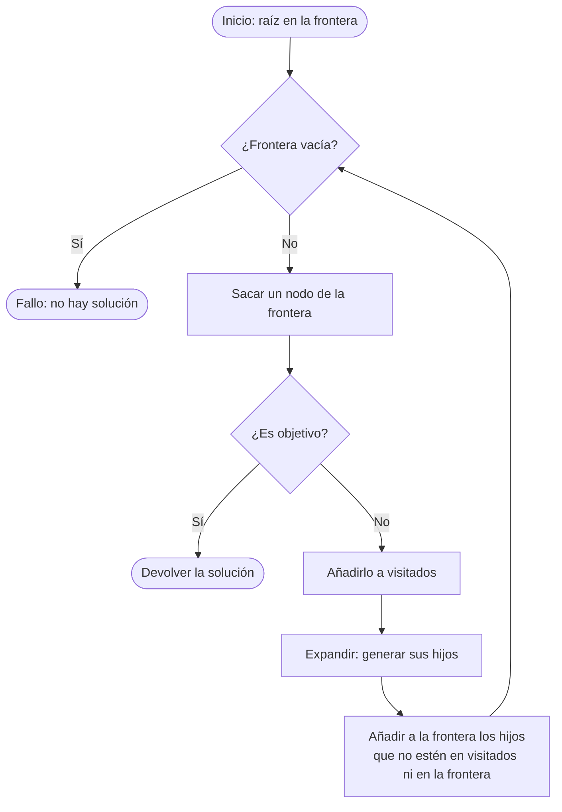
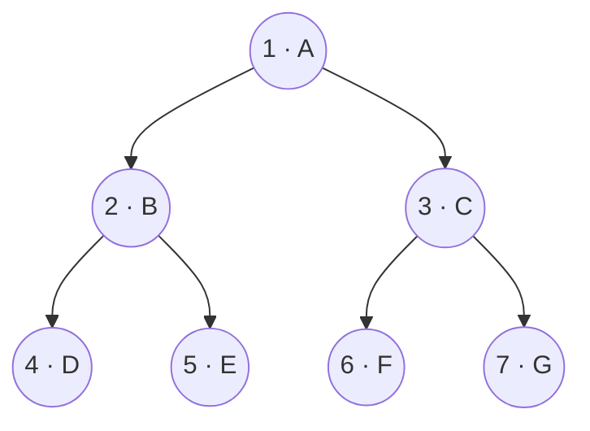
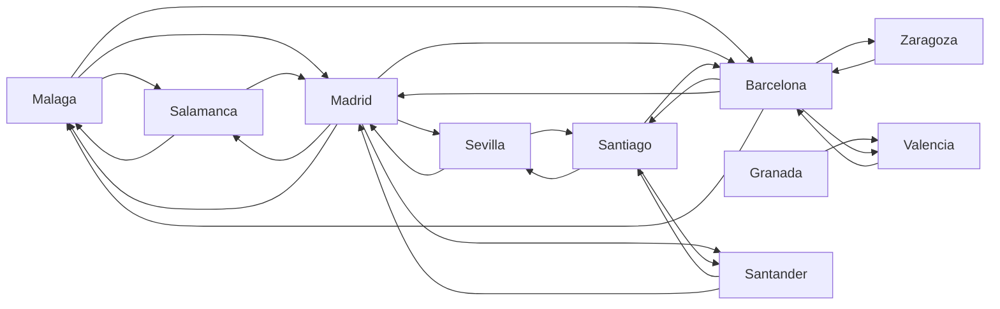
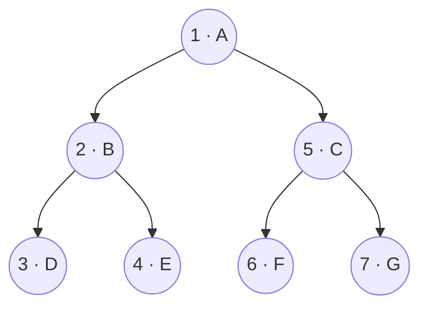
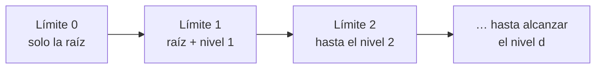
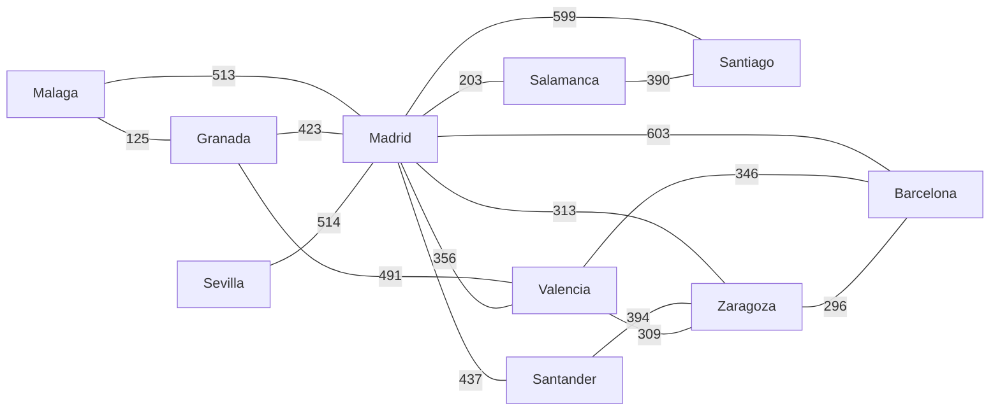

# Capítulo 2. Representación de problemas y búsqueda no informada

**Curso:** Introducción a la Inteligencia Artificial (electiva) · Ingeniería de Software – modalidad virtual · UDES
**Semana:** 2 de 8
**Tiempo estimado de lectura:** 100 minutos
**Lecturas base:** García Serrano (2016), caps. 2 y 3 · Russell y Norvig (2004), cap. 3

---

## Objetivos de aprendizaje

Al terminar este capítulo podrás:

1. Definir un problema a partir de su modelo, su objetivo y su función de evaluación.
2. Reconocer problemas canónicos de la IA, como el viajante de comercio, la satisfacibilidad booleana y la programación lineal entera, y explicar por qué su tamaño crece de forma explosiva.
3. Formular un problema de búsqueda con sus cuatro componentes: estado inicial, acciones, test objetivo y costo del camino.
4. Representar un espacio de estados como árbol o como grafo, y usar con precisión los términos nodo, expandir, frontera y lista de visitados.
5. Aplicar a mano y en Python la búsqueda en amplitud, la búsqueda en profundidad (con sus variantes limitada e iterativa) y la búsqueda de coste uniforme.
6. Comparar estas estrategias según su completitud, su optimalidad y su complejidad en tiempo y en espacio.

## ¿Cómo usar este capítulo?

- Lee una sección a la vez y responde los recuadros **«Para pensar»** antes de continuar.
- Ten a mano papel y lápiz: las secciones 2.5 a 2.7 se entienden mejor si sigues los ejemplos paso a paso.
- Los ejemplos del capítulo son los mismos del [cuaderno de la práctica](../practicas/), así que puedes ejecutar cada algoritmo mientras lees.
- Cuando el capítulo cita un libro, lo hace con el formato *(Autor, año, capítulo o página)*. La lista completa está en la sección [Referencias](#referencias).

---

## Introducción

Imagina que perdiste las llaves del carro. Sabes que están en alguna habitación de la casa, pero nada más. No te queda otra opción que buscar habitación por habitación hasta encontrarlas, porque ningún dato te indica por dónde empezar. García Serrano (2016, cap. 3) usa este ejemplo para presentar la **búsqueda no informada**, también llamada **búsqueda a ciegas**: la que se hace cuando el problema no ofrece más información que la de su propio enunciado.

En el capítulo 1 vimos que un agente inteligente percibe su entorno y actúa sobre él. Este capítulo estudia un tipo concreto de agente: el que resuelve un problema buscando, entre muchas secuencias de acciones posibles, una que lo lleve a su objetivo (Russell y Norvig, 2004, p. 67). Para lograrlo necesitamos dos cosas: **representar** el problema de forma que un computador pueda manejarlo y **buscar** la solución de forma sistemática. Las técnicas de esta semana son las más simples, pero son la base de todas las que siguen: la búsqueda informada y las metaheurísticas (semana 3) y los juegos con adversario (semana 4).

---

## 2.1 Resolver problemas con IA

### 2.1.1 ¿Qué es un problema?

García Serrano (2016, cap. 2) prefiere no dar una definición formal de «problema», porque es una cuestión más filosófica que informática. Se queda con una idea intuitiva: un problema es una cuestión difícil de solucionar, que no tiene una solución trivial. Aclara también que la IA no es una receta mágica, sino un conjunto de técnicas que, solas o combinadas, ayudan a encontrar una solución, no necesariamente la mejor, a problemas complejos o incluso inabordables para una persona.

Para ver cómo resolvemos problemas, el autor propone dos ejercicios escolares:

- **Problema 1.** Juan tiene 5 caramelos. Pierde uno en la calle y otro en la escalera. Al llegar a casa encuentra 3 que su hermano dejó sobre la mesa. ¿Cuántos caramelos tiene?
- **Problema 2.** Ordenar una lista de números de mayor a menor.

En el primero, el cerebro descarta lo superfluo (no importa *dónde* cayó el caramelo) y reduce todo el enunciado a una operación: 5 − 1 − 1 + 3 = 6. En el segundo, convierte una tarea compleja en una secuencia de operaciones simples: comparar pares de números una y otra vez. En ambos casos el cerebro construye un **modelo mental** que sí sabe manejar (García Serrano, 2016, cap. 2).

### 2.1.2 Modelo, objetivo y función de evaluación

García Serrano (2016, cap. 2) plantea dos problemas que acompañarán todo el capítulo:

- **Vuelos:** ir de una ciudad a otra con el **mínimo número de trasbordos**.
- **Carreteras:** ir de una ciudad a otra recorriendo el **menor número de kilómetros**.

Parecen el mismo problema, pero no lo son, porque sus objetivos son distintos. Para ir de Málaga a Santiago en avión, la mejor ruta es Málaga → Barcelona → Santiago (3 aeropuertos). Por carretera, las opciones Málaga → Madrid → Santiago (1.112 km) y Málaga → Madrid → Salamanca → Santiago (1.106 km) se comparan por kilómetros, no por número de ciudades.

> **Nota de precisión.** En el capítulo 2, García Serrano (2016) afirma que el mejor recorrido por carretera es el primero (1.112 km). Por el criterio que el propio autor define (la suma de kilómetros), el mejor es el segundo (1.106 km), y así lo confirma el mismo libro en el capítulo 3 al resolver el problema con búsqueda de coste uniforme.

De estos ejemplos se desprenden los tres elementos que, según García Serrano (2016, cap. 2), definen un problema:



*Figura 2.1. Elementos que definen un problema. Elaboración propia a partir de García Serrano (2016, cap. 2, fig. 2-3).*

- El **modelo** es una simplificación del problema real. Hay que tener claro que al resolver el modelo obtenemos la solución *del modelo*, no la del problema real: cuanto mejor lo describa, mejor se ajustará la solución a la realidad (García Serrano, 2016, cap. 2).
- El **objetivo** dice cuándo damos el problema por resuelto y cuáles son las soluciones válidas.
- La **función de evaluación** mide la calidad de una solución para compararla con otras: número de aeropuertos en el caso de los vuelos, suma de kilómetros en el de las carreteras.

### 2.1.3 El agente que resuelve problemas

Russell y Norvig (2004, pp. 67-69) describen el mismo proceso desde el punto de vista del agente. Un **agente resolvente-problemas** sigue tres fases:

1. **Formular:** decidir el objetivo (formulación del objetivo) y qué acciones y estados considerar para alcanzarlo (formulación del problema).
2. **Buscar:** examinar secuencias de acciones posibles hasta encontrar una que lleve al objetivo. Esa secuencia es la **solución**.
3. **Ejecutar:** llevar a cabo las acciones de la solución.

Este esquema supone un entorno estático, observable, discreto y determinista. Por eso el agente puede ejecutar la solución «con los ojos cerrados», sin mirar sus percepciones: Russell y Norvig (2004, p. 70) lo llaman un sistema de **lazo abierto**.

> **Para pensar.** Piensa en una aplicación de navegación como la que describiste en la práctica de la semana 1. ¿Qué parte del trabajo corresponde a formular, cuál a buscar y cuál a ejecutar? ¿El entorno de tránsito real cumple el supuesto de ser estático y determinista? ¿Qué hace la aplicación cuando no lo cumple?

---

## 2.2 Algunos problemas canónicos

Los problemas de esta sección no son arbitrarios: son **problemas canónicos**, bien estudiados, que sirven de modelo para atacar muchos otros parecidos (García Serrano, 2016, cap. 2). En la semana 3 los retomaremos con técnicas más potentes.

### 2.2.1 El problema del viajante de comercio (TSP)

**Enunciado:** dadas *N* ciudades conectadas entre sí y con distancias conocidas, encontrar la ruta que, empezando y terminando en la misma ciudad, pase exactamente una vez por cada una de las demás y minimice la distancia total (García Serrano, 2016, cap. 2). Se conoce por su sigla en inglés, TSP (*Travelling Salesman Problem*).

**Modelo.** Las ciudades pueden representarse como un grafo ponderado (cada arista es una carretera con su distancia) o como una **matriz de adyacencia**. García Serrano (2016, cap. 2) prefiere la matriz porque se implementa con un arreglo de dos dimensiones y la información no cambia durante la ejecución:

|   | A | B | C | D | E |
|:-:|:-:|:-:|:-:|:-:|:-:|
| **A** | 0 | 25 | 52 | 65 | 23 |
| **B** | 25 | 0 | 13 | 15 | 45 |
| **C** | 52 | 13 | 0 | 15 | 27 |
| **D** | 65 | 15 | 15 | 0 | 32 |
| **E** | 23 | 45 | 27 | 32 | 0 |

*Tabla 2.1. Distancias entre cinco ciudades. Tomado de García Serrano (2016, cap. 2).*

**Objetivo.** Una lista de ciudades que empieza y termina en la misma ciudad, contiene todas las ciudades y no repite ninguna salvo la primera.

**Función de evaluación.** La suma de las distancias recorridas. Por ejemplo (García Serrano, 2016, cap. 2):

| Ruta | Suma de distancias |
|---|:-:|
| A-B-E-D-C-A | 25 + 45 + 32 + 15 + 52 = 169 |
| A-E-D-C-B-A | 23 + 32 + 15 + 13 + 25 = **108** |
| A-C-D-E-B-A | 52 + 15 + 32 + 45 + 25 = 169 |

*Tabla 2.2. Tres soluciones posibles del TSP de la tabla 2.1 y su evaluación. Elaboración propia a partir de García Serrano (2016, cap. 2).*

En teoría bastaría con generar todas las rutas posibles y quedarnos con la de menor valor. El problema es cuántas son. Si las distancias son iguales en ambos sentidos, con *N* ciudades hay (*N* − 1)!/2 recorridos distintos:

| Ciudades | Recorridos distintos |
|:-:|:-:|
| 5 | 12 |
| 10 | 181.440 |
| 20 | ≈ 6,1 × 10¹⁶ |

*Tabla 2.3. Crecimiento del número de recorridos del TSP simétrico. Elaboración propia (cálculo de (N − 1)!/2).*

Por eso García Serrano (2016, cap. 2) advierte que, tras un enunciado tan simple, se esconde un problema tan difícil que ni los computadores más potentes pueden resolverlo de forma exacta para un número moderado de ciudades, aunque las técnicas de IA consiguen aproximaciones muy buenas. En términos técnicos, el TSP es un problema **NP-duro** (Russell y Norvig, 2004, p. 76), como demostró Karp (1972) (Russell y Norvig, 2004, p. 99).

### 2.2.2 El problema de la satisfacibilidad booleana (SAT)

Una variable booleana solo toma dos valores: verdadero (V) o falso (F). Con las operaciones conjunción (∧, AND), disyunción (∨, OR) y negación (¬, NOT) se construyen funciones booleanas. Una forma habitual de escribirlas es la **forma normal conjuntiva** (FNC): cláusulas formadas por disyunciones, unidas entre sí por conjunciones (García Serrano, 2016, cap. 2).

**Enunciado:** dada una función booleana *f* en FNC con *n* variables, ¿existe una asignación de valores que la haga verdadera? (García Serrano, 2016, cap. 2).

Por ejemplo, la función *f* = (*x*₂ ∨ *x*₄) ∧ (*x*₃ ∨ *x*₁) ∧ (*x*₂ ∨ ¬*x*₁) se satisface con *x*₁ = F, *x*₂ = V, *x*₃ = V, *x*₄ = F. Con cuatro variables se encuentra casi sin pensar, pero con tres variables por cláusula (el problema **3-SAT**) y 100 variables la situación cambia (García Serrano, 2016, cap. 2):

- **Modelo:** una cadena de 100 dígitos binarios; por ejemplo, la asignación anterior sería `0110`.
- **Espacio de estados:** 2¹⁰⁰ cadenas posibles, un número astronómico. De nuevo es un problema intratable de la clase NP.
- **Función de evaluación:** evaluar *f* solo dice verdadero o falso, y no permite saber cuál de dos asignaciones falsas está «más cerca». García Serrano (2016, cap. 2) propone una alternativa más informativa: **contar cuántas cláusulas son verdaderas**, porque en una FNC todas deben serlo.

### 2.2.3 El problema de la programación lineal entera (PLE)

**Enunciado:** optimizar (maximizar o minimizar) una función en la que intervienen variables enteras sujetas a restricciones. Es un caso particular de la programación lineal en el que todas o algunas variables deben ser enteras, y, aunque no lo parezca, es más difícil de resolver que la programación lineal con variables reales (García Serrano, 2016, cap. 2).

El ejemplo del libro es una empresa que fabrica pantalones y camisetas (García Serrano, 2016, cap. 2):

| | Pantalón | Camiseta | Disponible por semana |
|---|:-:|:-:|:-:|
| Horas de producción por prenda | 7 | 4 | 150 horas |
| Metros de tela por prenda | 6 | 5 | 160 metros |
| Costo de producción | 6 | 4 | |
| Precio de venta | 12 | 8 | |

*Tabla 2.4. Datos del problema de producción. Tomado de García Serrano (2016, cap. 2).*

Si *x*₁ es el número de pantalones y *x*₂ el de camisetas, el modelo es:

- **Maximizar** el beneficio *f*(*x*₁, *x*₂) = (12 − 6)*x*₁ + (8 − 4)*x*₂
- **Sujeto a:** 7*x*₁ + 4*x*₂ ≤ 150 (horas), 6*x*₁ + 5*x*₂ ≤ 160 (tela), *x*₁ ≥ 0, *x*₂ ≥ 0, con *x*₁ y *x*₂ enteros.

Aquí la función de evaluación es la misma función que se quiere maximizar. Con dos variables acotadas (*x*₁ no puede pasar de 21 y *x*₂ de 32) el espacio de estados tiene unos pocos cientos de combinaciones y un computador lo recorre sin esfuerzo, pero con más variables y rangos más amplios el problema se vuelve intratable (García Serrano, 2016, cap. 2).

> **Nota de precisión.** Al redactar las restricciones, el texto de García Serrano (2016, cap. 2) menciona «3 horas» por pantalón y «2» por camiseta, y «4 metros» y «3» de tela. Esas cifras no coinciden con la tabla ni con las ecuaciones del propio libro, que usan 7 y 4 horas, y 6 y 5 metros. Aquí se siguen la tabla y las ecuaciones.

### 2.2.4 De los problemas canónicos a los problemas reales

Resolver bien un problema canónico permite resolver muchos otros. Por ejemplo, el TSP es la base del **problema de rutas de vehículos** (VRP, *Vehicle Routing Problem*), que enfrentan las empresas de distribución: calcular las rutas que minimicen el número de vehículos y los kilómetros recorridos, teniendo en cuenta restricciones como la carga máxima de cada vehículo, los horarios de los clientes y de los conductores, la prioridad de algunos clientes, el número de almacenes y la posibilidad de volver a recargar (García Serrano, 2016, cap. 2).

Russell y Norvig (2004, p. 72) distinguen dos tipos de problemas:

- **Problemas de juguete:** ilustran o ejercitan métodos de resolución. Tienen una descripción exacta y concisa, por lo que sirven para comparar algoritmos. Ejemplos: el puzle lineal de este capítulo, el 8-puzle y las 8 reinas.
- **Problemas del mundo real:** son aquellos cuyas soluciones preocupan a la gente, como la búsqueda de rutas en redes de computadores, la planificación de viajes aéreos o el propio TSP (Russell y Norvig, 2004, p. 76).

Los problemas de juguete también muestran lo rápido que crece un espacio de estados:

| Problema | Número de estados |
|---|---|
| 8-puzle (tablero 3 × 3) | 9!/2 = 181.440 estados alcanzables |
| 15-puzle (tablero 4 × 4) | ≈ 1,3 billones |
| 24-puzle (tablero 5 × 5) | ≈ 10²⁵ |
| 8 reinas, formulación ingenua (colocar reinas en cualquier casilla vacía) | 64 · 63 · … · 57 ≈ 3 × 10¹⁴ secuencias |
| 8 reinas, formulación mejorada (una reina por columna, sin ataques) | 2.057 estados |

*Tabla 2.5. Tamaño del espacio de estados de algunos problemas de juguete. Elaboración propia a partir de Russell y Norvig (2004, pp. 74-75).*

La última fila deja una lección importante: **la forma de formular el problema cambia su tamaño de manera dramática**. Para 100 reinas, la formulación mejorada reduce el espacio de unos 10⁴⁰⁰ estados a unos 10⁵² (Russell y Norvig, 2004, p. 75).

> **Para pensar.** Elige un problema de tu vida académica o laboral que se parezca a uno de los problemas canónicos (armar un horario de clases, repartir tareas en un equipo, planear un recorrido de visitas). ¿Cuál sería su modelo, su objetivo y su función de evaluación?

---

## 2.3 Formular un problema de búsqueda

### 2.3.1 Los cuatro componentes de un problema

Russell y Norvig (2004, pp. 70-71) definen formalmente un problema con cuatro componentes:

1. **Estado inicial:** el estado en el que comienza el agente.
2. **Acciones:** lo que el agente puede hacer. Se describen con una **función sucesor** que, dado un estado *x*, devuelve los pares ⟨acción, estado resultante⟩. El estado inicial y la función sucesor definen implícitamente el **espacio de estados**: el conjunto de todos los estados alcanzables desde el inicial. Ese espacio forma un **grafo** en el que los nodos son estados y los arcos son acciones. Un **camino** es una secuencia de estados conectados por acciones.
3. **Test objetivo:** determina si un estado es un estado objetivo.
4. **Costo del camino:** una función que asigna un costo numérico a cada camino. Suele ser la suma de los **costos individuales** de cada acción, *c*(*x*, *a*, *y*), que se suponen no negativos.

Una **solución** es un camino desde el estado inicial hasta un estado objetivo. La **solución óptima** es la de menor costo del camino entre todas las soluciones (Russell y Norvig, 2004, p. 71).

Estos cuatro componentes encajan con los tres elementos de García Serrano: el estado inicial y las acciones forman el **modelo**, el test objetivo expresa el **objetivo**, y el costo del camino es la **función de evaluación**.

### 2.3.2 Abstracción

Formular un problema exige decidir qué detalles dejar fuera. Un viaje por carretera real incluye el clima, el paisaje y la emisora de radio, pero nada de eso importa para encontrar la ruta. A este proceso de eliminar detalles de una representación se le llama **abstracción**. Una buena abstracción elimina todo el detalle posible, pero conserva la validez: cada solución abstracta debe poder convertirse en una solución del problema real (Russell y Norvig, 2004, p. 72). Es la misma idea del caramelo de Juan en la sección 2.1.1.

### 2.3.3 Un ejemplo completo: el puzle lineal

El problema que usa García Serrano (2016, cap. 3) para presentar la búsqueda no informada es un **puzle lineal**: un rompecabezas infantil de piezas grandes que solo se unen en línea. Las piezas están numeradas del 1 al 4 y el objetivo es ordenarlas.

| Componente | Puzle lineal de 4 piezas |
|---|---|
| **Estados** | Cualquier ordenación de las 4 piezas, representada como un arreglo, por ejemplo `[3, 1, 2, 4]`. Hay 4! = 24 estados posibles. |
| **Estado inicial** | Cualquier ordenación; por ejemplo, `[3, 1, 2, 4]`. |
| **Acciones** | Tres operadores que intercambian dos piezas contiguas: **I** (las dos de la izquierda), **C** (las dos centrales) y **D** (las dos de la derecha). |
| **Test objetivo** | ¿El estado es `[1, 2, 3, 4]`? |
| **Costo del camino** | Cada intercambio cuesta 1, así que el costo es el número de movimientos. |

*Tabla 2.6. Formulación del puzle lineal. Elaboración propia a partir de García Serrano (2016, cap. 3).*

Con solo cuatro piezas el problema se resuelve examinando todos los estados, pero García Serrano (2016, cap. 3) advierte que con más piezas se volvería intratable. En la práctica lo comprobarás: con 8 piezas ya hay 40.320 estados.

Como la búsqueda no informada no usa más información que el enunciado, la función de evaluación solo comprueba si hemos llegado al objetivo. Contar cuántas piezas están bien colocadas sería una información útil para guiar la búsqueda, y eso es justamente lo que hará la **búsqueda informada** de la semana 3 (García Serrano, 2016, cap. 3).

---

## 2.4 Buscar soluciones: árboles, grafos y la frontera

### 2.4.1 El árbol de estados

Si aplicamos los operadores I, C y D al estado inicial `[3, 1, 2, 4]` obtenemos tres estados nuevos, y a cada uno de ellos podemos volver a aplicarle los tres operadores. El resultado es un **árbol**:



*Figura 2.2. Dos niveles del árbol de estados del puzle lineal. Elaboración propia a partir de García Serrano (2016, cap. 3, fig. 3-2).*

García Serrano (2016, cap. 3) usa la terminología de la teoría de árboles y grafos:

- Cada estado es un **nodo**.
- Los nodos que resultan de aplicar los operadores son **nodos hijos** del nodo que los generó, que es su **nodo padre**. Los hijos de un mismo padre son **hermanos**.
- El **nodo raíz** es el único sin padre; corresponde al estado inicial.
- Una **hoja** es un nodo sin hijos, y una **rama** es un nodo que tiene padre y al menos un hijo.
- Como cada nodo tiene tres hijos, el árbol tiene un **factor de ramificación** de 3. Cada vez que se aplica un operador se desciende un **nivel**.

### 2.4.2 Del árbol al grafo

En la figura 2.2 aparecen estados repetidos: si al estado inicial le aplicamos D y luego otra vez D, volvemos al estado inicial. Cuando esto ocurre, los estados se pueden modelar como un **grafo**, una estructura similar al árbol pero que admite ciclos. Si se puede pasar de un estado a otro en ambos sentidos, el grafo se dibuja con una línea; si solo en un sentido, con una flecha (García Serrano, 2016, cap. 3).

Los ciclos son peligrosos: el programa podría quedar dando vueltas en ellos indefinidamente. La forma habitual de evitarlo es **recordar los nodos visitados** y comprobar, cada vez que se llega a uno nuevo, que no se haya visitado antes (García Serrano, 2016, cap. 3).

Russell y Norvig (2004, p. 78) insisten en una distinción importante: **un nodo no es lo mismo que un estado**. El estado es una configuración del mundo; el nodo es una estructura de datos del árbol de búsqueda con cinco campos: el ESTADO, el NODO PADRE, la ACCIÓN que lo generó, el COSTO DEL CAMINO desde la raíz, *g*(*n*), y la PROFUNDIDAD. Un mismo estado puede aparecer en muchos nodos, alcanzado por caminos distintos. Por ejemplo, el mapa de Rumania de su libro tiene solo 20 estados, pero su árbol de búsqueda es infinito, porque se puede ir y volver entre dos ciudades sin fin.

### 2.4.3 El algoritmo general de búsqueda

Buscar una solución es recorrer el árbol o el grafo hasta encontrar un nodo que contenga un estado objetivo. En un **árbol**, el recorrido tiene estos pasos (García Serrano, 2016, cap. 3):

1. Tomar el nodo raíz y guardarlo en una lista de nodos pendientes de visitar, llamada **frontera** (o **lista abierta**).
2. Sacar un nodo de la frontera y comprobar si es un nodo objetivo. Si lo es, terminar.
3. Generar todos los hijos del nodo aplicando los operadores. Esto se llama **expandir** el nodo. Añadir los hijos a la frontera.
4. Volver al paso 2 mientras la frontera no esté vacía.

En un **grafo** el proceso cambia ligeramente: cada nodo que se saca de la frontera se guarda en una lista de **visitados**, y un hijo solo se añade a la frontera si no está en esa lista (García Serrano, 2016, cap. 3). Russell y Norvig (2004, p. 93) llaman a esta lista **lista cerrada** y al algoritmo resultante BÚSQUEDA-GRAFOS.



*Figura 2.3. Algoritmo general de búsqueda en grafos. Elaboración propia a partir de García Serrano (2016, cap. 3) y Russell y Norvig (2004, p. 93, fig. 3.19).*

La **solución** se reconstruye siguiendo los punteros al padre, desde el nodo objetivo hasta la raíz (García Serrano, 2016, cap. 3).

Todo el algoritmo depende de una sola decisión: **¿qué nodo se saca de la frontera en el paso 2?** Esa decisión es la **estrategia de búsqueda** (Russell y Norvig, 2004, p. 78), y cada estrategia de este capítulo la resuelve con una estructura de datos distinta:

| Estrategia | Estructura de la frontera | Nodo que sale primero |
|---|---|---|
| Búsqueda en amplitud | Cola FIFO | El más antiguo (el menos profundo) |
| Búsqueda en profundidad | Pila LIFO | El más reciente (el más profundo) |
| Búsqueda de coste uniforme | Cola con prioridad | El de menor costo acumulado *g*(*n*) |

*Tabla 2.7. La estructura de la frontera define la estrategia. Elaboración propia a partir de García Serrano (2016, cap. 3).*

### 2.4.4 ¿Cómo medir una estrategia?

Para comparar estrategias se usan cuatro criterios (García Serrano, 2016, cap. 3; Russell y Norvig, 2004, pp. 80-81):

| Criterio | Pregunta que responde |
|---|---|
| **Completitud** | Si existe una solución, ¿el algoritmo la encuentra siempre? |
| **Optimalidad** | ¿La solución que encuentra es la mejor (la de menor costo)? |
| **Complejidad en tiempo** | ¿Cuánto tarda? Se mide por el número de nodos generados. |
| **Complejidad en espacio** | ¿Cuánta memoria necesita? Se mide por el máximo número de nodos almacenados. |

*Tabla 2.8. Criterios para evaluar una estrategia de búsqueda. Elaboración propia a partir de García Serrano (2016, cap. 3) y Russell y Norvig (2004, pp. 80-81).*

García Serrano (2016, cap. 3) comenta que «optimalidad» es una mala traducción del inglés *optimality*; Russell y Norvig (2004) usan «optimización». En este curso usaremos **optimalidad**, que es el término más frecuente.

La complejidad se expresa con tres cantidades (Russell y Norvig, 2004, p. 81):

- ***b***: el **factor de ramificación**, o número máximo de sucesores de un nodo.
- ***d***: la **profundidad** del nodo objetivo más superficial.
- ***m***: la longitud máxima de cualquier camino en el espacio de estados.

Y se escribe con la **notación O grande**, una cota superior de la función que se analiza cuando el argumento tiende a infinito (García Serrano, 2016, cap. 3). Por ejemplo, *O*(*b*ᵈ) indica que el número de nodos crece, como mucho, en proporción a *b* elevado a *d*.

> **Para pensar.** ¿Por qué el tiempo se mide en nodos generados y no en segundos? Pista: piensa en qué pasaría con la comparación entre dos algoritmos si cada estudiante los ejecutara en un computador diferente.

---

## 2.5 Búsqueda en amplitud (BFS)

### 2.5.1 El algoritmo

La **búsqueda en amplitud** o *Breadth First Search* (BFS) recorre el árbol **por niveles**: primero visita el nodo raíz, luego todos sus hijos, luego todos los hijos de estos, y así sucesivamente. Se implementa con una **cola FIFO** (*First In, First Out*) para la frontera: los nodos salen en el mismo orden en que entraron (García Serrano, 2016, cap. 3).



*Figura 2.4. Orden en que la búsqueda en amplitud visita los nodos de un árbol binario. Elaboración propia a partir de Russell y Norvig (2004, p. 83, fig. 3.10).*

En pseudocódigo (adaptado de García Serrano, 2016, listado 3-1):

```text
nodos_frontera = Cola FIFO con el nodo inicial
nodos_visitados = lista vacía
mientras nodos_frontera no esté vacía:
    nodo_actual = extraer el primer nodo de nodos_frontera
    si nodo_actual es solución: salir con la solución
    añadir nodo_actual a nodos_visitados
    por cada operador:
        nodo_hijo = operador(nodo_actual)
        si nodo_hijo no está en nodos_visitados ni en nodos_frontera:
            añadir nodo_hijo al final de nodos_frontera
```

### 2.5.2 Dos ejemplos

**Puzle lineal.** Desde `[4, 2, 3, 1]`, BFS encuentra esta solución de 5 movimientos (García Serrano, 2016, listado 3-3):

`[4,2,3,1] → [2,4,3,1] → [2,3,4,1] → [2,3,1,4] → [2,1,3,4] → [1,2,3,4]`

**Vuelos.** Las conexiones del problema de los vuelos se representan en Python con un **diccionario** que asocia cada ciudad con el conjunto de ciudades a las que hay vuelo directo (García Serrano, 2016, listado 3-4):



*Figura 2.5. Grafo dirigido de conexiones de vuelos. Elaboración propia a partir de García Serrano (2016, listado 3-4).*

Para ir de Málaga a Santiago, BFS propone `Málaga → Barcelona → Santiago`. Es una solución óptima según el objetivo definido: aunque hay otras rutas, ninguna tiene menos trasbordos (García Serrano, 2016, cap. 3).

### 2.5.3 Propiedades

**Completitud.** Si existe una solución, BFS acabará encontrándola (otra cosa es en cuánto tiempo), siempre que el factor de ramificación sea finito (García Serrano, 2016, cap. 3; Russell y Norvig, 2004, p. 82).

**Optimalidad.** Depende de lo que signifique «mejor» en cada problema:

- En el puzle lineal, cada movimiento baja un nivel del árbol. Como BFS recorre por niveles, la primera solución que encuentra es la de menos movimientos: **es óptima**.
- En los vuelos ocurre lo mismo con los trasbordos: **es óptima**.
- En las carreteras no. Con una red como la de la figura 3-5 de García Serrano (2016), la ruta Ciudad 1 → Ciudad 5 (827 km) aparece en un nivel menos profundo que Ciudad 1 → Ciudad 4 → Ciudad 5 (521 km). BFS devuelve la primera, que pasa por menos ciudades pero recorre más kilómetros: **no es óptima**.

En general, BFS es óptima cuando el costo del camino es una función no decreciente de la profundidad del nodo; el caso típico es que todas las acciones tengan el mismo costo (García Serrano, 2016, cap. 3; Russell y Norvig, 2004, p. 82).

**Complejidad.** Si cada nodo tiene *b* hijos, la raíz genera *b* nodos en el primer nivel, *b*² en el segundo y *b*ᵈ en el nivel *d*. García Serrano (2016, cap. 3) expresa la complejidad temporal como *O*(*b*ᵈ). Como BFS guarda en memoria todos los nodos generados, la complejidad espacial es del mismo orden.

> **Nota de precisión.** Russell y Norvig (2004, p. 83) dan para BFS una complejidad de *O*(*b*ᵈ⁺¹), un nivel más que García Serrano. La diferencia está en el momento en que se aplica el test objetivo: en la versión de Russell y Norvig el objetivo se comprueba al *expandir* un nodo, así que en el peor caso se generan también los hijos de los nodos del nivel *d* antes de detectar la solución. Las dos expresiones dicen lo mismo en lo esencial: el costo crece de forma **exponencial** con la profundidad.

### 2.5.4 La memoria es el gran problema

Russell y Norvig (2004, p. 83) muestran qué significa este crecimiento exponencial con un factor de ramificación *b* = 10, una velocidad de 10.000 nodos por segundo y 1.000 bytes por nodo:

| Profundidad | Nodos | Tiempo | Memoria |
|:-:|:-:|:-:|:-:|
| 2 | 1.100 | 0,11 segundos | 1 megabyte |
| 4 | 111.100 | 11 segundos | 106 megabytes |
| 6 | 10⁷ | 19 minutos | 10 gigabytes |
| 8 | 10⁹ | 31 horas | 1 terabyte |
| 10 | 10¹¹ | 129 días | 101 terabytes |
| 12 | 10¹³ | 35 años | 10 petabytes |
| 14 | 10¹⁵ | 3.523 años | 1 exabyte |

*Tabla 2.9. Requisitos de tiempo y espacio de la búsqueda en amplitud. Tomado de Russell y Norvig (2004, p. 83, fig. 3.11).*

> **Nota de precisión.** En la edición en español de Russell y Norvig (2004, p. 83), la fila de profundidad 2 indica «11 segundos». Con los supuestos de la propia figura, 1.100 nodos a 10.000 nodos por segundo toman 0,11 segundos, que es el valor que se usa en la tabla 2.9.

De la tabla se desprenden dos lecciones (Russell y Norvig, 2004, p. 84):

1. **La memoria es un problema más grande que el tiempo.** Esperar 31 horas por la solución de un problema importante puede ser aceptable; tener terabytes de memoria principal, no.
2. **El tiempo también importa.** A profundidad 12 la solución tardaría 35 años. En general, *los problemas de búsqueda de complejidad exponencial no pueden resolverse con métodos sin información, salvo en casos pequeños*.

> **Para pensar.** Con los supuestos de la tabla 2.9, ¿cuántos nodos por segundo tendría que generar un computador para que la búsqueda a profundidad 12 tardara un día en lugar de 35 años? ¿Resolvería eso el problema de la memoria?

---

## 2.6 Búsqueda en profundidad y sus variantes

### 2.6.1 El algoritmo

La **búsqueda en profundidad** o *Depth First Search* (DFS) recorre el árbol de otra manera: en lugar de visitar todos los nodos de un nivel, desciende hasta el nodo más profundo de una rama y, al llegar al final, continúa con la siguiente (García Serrano, 2016, cap. 3).



*Figura 2.6. Orden en que la búsqueda en profundidad visita los nodos del mismo árbol binario de la figura 2.4. Elaboración propia a partir de Russell y Norvig (2004, p. 85, fig. 3.12).*

La implementación solo cambia en la estructura de la frontera: una **pila LIFO** (*Last In, First Out*) en vez de una cola FIFO. Como en una pila de platos, siempre se toma el último que se puso encima (García Serrano, 2016, cap. 3). El pseudocódigo es idéntico al de la sección 2.5.1, salvo que el nodo que se extrae es el **último** que entró (García Serrano, 2016, listado 3-5).

Como DFS siempre avanza hacia el hijo más reciente, también puede escribirse de forma **recursiva**: la función se llama a sí misma con cada hijo no visitado (García Serrano, 2016, listado 3-7; Russell y Norvig, 2004, p. 85).

### 2.6.2 Propiedades

**Optimalidad.** Desde `[4, 2, 3, 1]`, DFS resuelve el puzle lineal en **11 movimientos**, frente a los 5 de BFS (García Serrano, 2016, listado 3-6):

`[4,2,3,1] → [4,2,1,3] → [4,1,2,3] → [4,1,3,2] → [4,3,1,2] → [3,4,1,2] → [3,4,2,1] → [3,2,4,1] → [3,2,1,4] → [3,1,2,4] → [1,3,2,4] → [1,2,3,4]`

La solución es válida, pero no es la mejor: DFS **no es óptima** (García Serrano, 2016, cap. 3). Russell y Norvig (2004, p. 86) lo explican así: DFS puede hacer una elección equivocada y seguir un camino muy largo, aun cuando otra elección llevaría a una solución cerca de la raíz.

**Completitud.** Si el árbol no está acotado en profundidad, DFS puede bajar por una rama infinita y no salir nunca de ella (García Serrano, 2016, cap. 3). Si se usa la lista de visitados en un espacio de estados finito, la búsqueda es completa; si se prescinde de ella para ahorrar memoria, deja de serlo, porque puede entrar en ciclos (García Serrano, 2016, cap. 3).

**Tiempo.** Con un árbol de profundidad máxima *m*, la complejidad temporal es *O*(*b*ᵐ). Como en la mayoría de los casos *m* > *d*, DFS suele ser, en tiempo, igual o peor que BFS (García Serrano, 2016, cap. 3; Russell y Norvig, 2004, pp. 86-87).

**Espacio: la gran ventaja.** Entonces, ¿para qué sirve DFS? Por la memoria. En un árbol, DFS solo necesita guardar el camino desde la raíz hasta el nodo actual y los hermanos pendientes de cada nodo de ese camino: *bm* + 1 nodos, es decir, *O*(*bm*) (Russell y Norvig, 2004, pp. 85-86; García Serrano, 2016, cap. 3). Los números lo muestran:

- Para el puzle lineal, suponiendo 1 kilobyte por nodo, recorrer el árbol hasta el nivel 10 necesita unos **60 megabytes** con BFS y unos **90 kilobytes** con DFS (García Serrano, 2016, cap. 3).
- Con los supuestos de la tabla 2.9, a profundidad 12 DFS necesitaría **118 kilobytes** en lugar de **10 petabytes** (Russell y Norvig, 2004, p. 86).

Russell y Norvig (2004, p. 86) mencionan además una variante, la **búsqueda hacia atrás** (*backtracking*), que genera un solo sucesor a la vez y necesita solo *O*(*m*) de memoria.

### 2.6.3 Búsqueda en profundidad limitada

Para evitar que DFS descienda sin fin por una rama infinita, se le puede imponer un **límite de profundidad** ℓ: los nodos que están en ese nivel se tratan como si no tuvieran sucesores (García Serrano, 2016, cap. 3; Russell y Norvig, 2004, p. 87). El límite resuelve el problema del camino infinito, pero introduce otros dos:

- Si el límite es menor que la profundidad de la solución (ℓ < *d*), la búsqueda **no es completa**: la solución queda fuera de su alcance.
- Si el límite es mayor (ℓ > *d*), la búsqueda **no es óptima**.

Su complejidad es *O*(*b*ˡ) en tiempo y *O*(*b*ℓ) en espacio. La DFS normal es un caso especial con ℓ = ∞ (Russell y Norvig, 2004, p. 87).

A veces el conocimiento del problema sugiere un buen límite. En el mapa de Rumania de Russell y Norvig hay 20 ciudades, así que cualquier solución tiene como mucho 19 pasos. Estudiando el mapa se descubre que cualquier ciudad se alcanza desde otra en nueve pasos como máximo; ese número se llama el **diámetro** del espacio de estados y es un límite mejor (Russell y Norvig, 2004, p. 87).

La búsqueda limitada puede terminar de dos formas distintas: con **fallo** (no hay solución) o con **corte** (no hay solución *dentro del límite*) (Russell y Norvig, 2004, p. 87).

### 2.6.4 Búsqueda con profundidad iterativa

¿Y si no conocemos un buen límite? La **búsqueda con profundidad iterativa** repite la búsqueda limitada aumentando el límite poco a poco (0, 1, 2, …) hasta encontrar el objetivo (García Serrano, 2016, cap. 3; Russell y Norvig, 2004, p. 87). Combina lo mejor de las dos búsquedas anteriores:

- Como DFS, necesita poca memoria: *O*(*bd*).
- Como BFS, es completa cuando el factor de ramificación es finito, y óptima cuando el costo del camino no disminuye con la profundidad (Russell y Norvig, 2004, p. 88).



*Figura 2.7. La profundidad iterativa como una secuencia de búsquedas limitadas. Elaboración propia a partir de Russell y Norvig (2004, p. 89, fig. 3.15).*

Parece un desperdicio, porque los niveles superiores se generan una y otra vez. Pero no lo es tanto: en un árbol con un factor de ramificación parecido en todos los niveles, **la mayoría de los nodos está en el último nivel**. Los nodos del nivel *d* se generan una vez, los del nivel *d* − 1 dos veces, y así hasta los hijos de la raíz, que se generan *d* veces (García Serrano, 2016, cap. 3; Russell y Norvig, 2004, p. 88). Con *b* = 10 y *d* = 5:

| Estrategia | Nodos generados |
|---|---|
| Profundidad iterativa | 50 + 400 + 3.000 + 20.000 + 100.000 = **123.450** |
| Amplitud | 10 + 100 + 1.000 + 10.000 + 100.000 + 999.990 = **1.111.100** |

*Tabla 2.10. Nodos generados por la profundidad iterativa y por la búsqueda en amplitud con b = 10 y d = 5. Tomado de Russell y Norvig (2004, p. 88).*

La profundidad iterativa resulta incluso más rápida que BFS, porque no genera nodos en el nivel *d* + 1. Por eso Russell y Norvig (2004, p. 88) concluyen que *la profundidad iterativa es el método de búsqueda no informada preferido cuando el espacio de búsqueda es grande y no se conoce la profundidad de la solución*. García Serrano (2016, cap. 3) llega a la misma recomendación. En el problema de los vuelos, la profundidad iterativa encuentra la misma solución óptima que BFS: `Málaga → Barcelona → Santiago` (García Serrano, 2016, listado 3-11).

### 2.6.5 Búsqueda bidireccional

Una última idea: ejecutar dos búsquedas a la vez, una hacia delante desde el estado inicial y otra hacia atrás desde el objetivo, y parar cuando se encuentren en el medio. Como *b*ᵈᐟ² + *b*ᵈᐟ² es mucho menor que *b*ᵈ, el ahorro es enorme: con *b* = 10 y una solución a profundidad 6, bastan 22.200 nodos frente a 11.111.100 de una BFS estándar (Russell y Norvig, 2004, pp. 89-90).

Tiene dos dificultades. Al menos uno de los dos árboles debe mantenerse en memoria, y buscar hacia atrás exige poder calcular los **predecesores** de cada estado, lo que no siempre es posible. Por ejemplo, en ajedrez el objetivo «jaque mate» describe un conjunto enorme de estados y no hay una forma general eficiente de buscar hacia atrás desde él (Russell y Norvig, 2004, pp. 90-91).

> **Para pensar.** El puzle lineal tiene acciones reversibles: aplicar dos veces el mismo operador devuelve el estado original. ¿Facilita eso una búsqueda bidireccional? ¿Y en el problema de los vuelos, donde las conexiones tienen sentido?

---

## 2.7 Búsqueda de coste uniforme (UCS)

### 2.7.1 El algoritmo

Con las estrategias anteriores podemos encontrar *una* ruta por carretera, pero no necesariamente la de menos kilómetros. La **búsqueda de coste uniforme** o *Uniform Cost Search* (UCS) incorpora un nuevo factor: el **coste**. A cada nodo se le asocia la función ***g*(*n*)**, el costo de recorrer el camino desde el nodo raíz hasta el nodo *n*, que es la suma de los costos de cada tramo (García Serrano, 2016, cap. 3).

UCS usa una **cola con prioridad**, ordenada según *g*(*n*), y siempre saca el nodo de **menor costo acumulado** (García Serrano, 2016, cap. 3; Russell y Norvig, 2004, p. 84). Hay un detalle adicional: si un hijo ya está en la frontera pero el nuevo camino hasta él es más barato, se reemplaza el nodo de la frontera por el nuevo (García Serrano, 2016, listado 3-12).

Russell y Norvig (2004, p. 100) señalan que el algoritmo del camino más corto de **Dijkstra (1959)** es el origen de la búsqueda de coste uniforme.

### 2.7.2 Un ejemplo paso a paso

Queremos ir por carretera de Málaga a Santiago con el menor número de kilómetros. El mapa es este (García Serrano, 2016, listado 3-13):



*Figura 2.8. Red de carreteras con distancias en kilómetros. Elaboración propia a partir de García Serrano (2016, listado 3-13).*

En cada paso se selecciona el nodo de la frontera con menor *g*(*n*) (entre paréntesis):

| Paso | Frontera antes de seleccionar | Se selecciona | Hijos no visitados que entran o mejoran |
|:-:|---|---|---|
| 1 | Málaga(0) | Málaga(0) | Granada(125), Madrid(513) |
| 2 | Granada(125), Madrid(513) | Granada(125) | Valencia(616). Madrid por Granada costaría 548: no mejora |
| 3 | Madrid(513), Valencia(616) | Madrid(513) | Salamanca(716), Zaragoza(826), Santander(950), Sevilla(1027), Santiago(1112), Barcelona(1116). Valencia por Madrid costaría 868: no mejora |
| 4 | Valencia(616), Salamanca(716), Zaragoza(826), … | Valencia(616) | Barcelona **mejora** a 962 |
| 5 | Salamanca(716), Zaragoza(826), Santander(950), Barcelona(962), … | Salamanca(716) | Santiago **mejora** a 1106 |
| 6 | Zaragoza(826), Santander(950), Barcelona(962), Sevilla(1027), Santiago(1106) | Zaragoza(826) | Ninguno mejora |
| 7 | Santander(950), Barcelona(962), Sevilla(1027), Santiago(1106) | Santander(950) | Ninguno |
| 8 | Barcelona(962), Sevilla(1027), Santiago(1106) | Barcelona(962) | Ninguno |
| 9 | Sevilla(1027), Santiago(1106) | Sevilla(1027) | Ninguno |
| 10 | Santiago(1106) | **Santiago(1106)** | Objetivo alcanzado |

*Tabla 2.11. Traza de la búsqueda de coste uniforme de Málaga a Santiago. Elaboración propia a partir de García Serrano (2016, cap. 3), verificada con el cuaderno de la práctica.*

La solución es **Málaga → Madrid → Salamanca → Santiago, con 1.106 km**, la ruta de menor distancia. La ruta Málaga → Madrid → Santiago pasa por menos ciudades, pero recorre 1.112 km (García Serrano, 2016, cap. 3).

> **Nota de precisión.** La tabla paso a paso de García Serrano (2016, cap. 3) termina en 9 pasos: en el paso 9 selecciona Santiago(1106), aunque en la frontera está Sevilla(1027), que tiene menor costo. Una búsqueda de coste uniforme estricta expande primero Sevilla y selecciona Santiago en el paso 10, como muestra la tabla 2.11. La solución final no cambia.

Observa dos detalles de la traza:

- En el paso 3 aparece Santiago con 1.112 km, pero la búsqueda **no se detiene**: el objetivo solo se comprueba cuando un nodo *sale* de la frontera para ser expandido (Russell y Norvig, 2004, p. 84). Gracias a eso, en el paso 5 se descubre un camino más corto (1.106 km).
- Si el test objetivo se aplicara al *generar* los hijos, la búsqueda habría devuelto la ruta de 1.112 km y habría perdido la optimalidad.

### 2.7.3 Propiedades

**Optimalidad.** UCS es óptima porque siempre escoge el nodo de menor costo acumulado: cuando encuentra un nodo objetivo, no puede existir una solución más barata, porque la habría encontrado antes (García Serrano, 2016, cap. 3). Russell y Norvig (2004, p. 84) precisan la condición: el costo de cada paso debe ser **mayor o igual que una constante positiva pequeña ε**. Si hubiera acciones de costo cero que devuelven al mismo estado, UCS podría quedar atrapada en un ciclo infinito.

**Completitud.** Es completa siempre que los costos sean positivos (García Serrano, 2016, cap. 3), con la misma condición de ε (Russell y Norvig, 2004, p. 84).

**Complejidad.** UCS se guía por los costos y no por la profundidad, así que su complejidad no se puede expresar fácilmente en términos de *b* y *d*. Si *C*\* es el costo de la solución óptima y cada acción cuesta al menos ε, la complejidad en tiempo y en espacio en el peor caso es *O*(*b*^⌈*C*\*/ε⌉), que puede ser mucho mayor que *b*ᵈ (Russell y Norvig, 2004, p. 84).

**Relación con BFS.** Si todos los costos son iguales, UCS se comporta igual que BFS: *b*^⌈*C*\*/ε⌉ es justamente *b*ᵈ (Russell y Norvig, 2004, p. 84; García Serrano, 2016, cap. 3). Lo comprobarás en el ejercicio 4 de la práctica.

> **Para pensar.** UCS es óptima y completa. ¿Por qué entonces no la usamos siempre? Piensa en qué pasa con la memoria y en cuánta información sobre el problema sigue sin aprovechar. (Esa pregunta abre la semana 3.)

---

## 2.8 Comparación de estrategias y estados repetidos

### 2.8.1 Tabla comparativa

| Criterio | Amplitud | Coste uniforme | Profundidad | Profundidad limitada | Profundidad iterativa | Bidireccional |
|---|:-:|:-:|:-:|:-:|:-:|:-:|
| ¿Completa? | Sí ᵃ | Sí ᵃ ᵇ | No | No | Sí ᵃ | Sí ᵃ ᵈ |
| Tiempo | *O*(*b*ᵈ⁺¹) | *O*(*b*^⌈*C*\*/ε⌉) | *O*(*b*ᵐ) | *O*(*b*ˡ) | *O*(*b*ᵈ) | *O*(*b*ᵈᐟ²) |
| Espacio | *O*(*b*ᵈ⁺¹) | *O*(*b*^⌈*C*\*/ε⌉) | *O*(*bm*) | *O*(*b*ℓ) | *O*(*bd*) | *O*(*b*ᵈᐟ²) |
| ¿Óptima? | Sí ᶜ | Sí | No | No | Sí ᶜ | Sí ᶜ ᵈ |

*Tabla 2.12. Evaluación de las estrategias de búsqueda no informada. Tomado de Russell y Norvig (2004, p. 91, fig. 3.17). ᵃ Completa si b es finito. ᵇ Completa si el costo de cada paso es ≥ ε, con ε positivo. ᶜ Óptima si todos los costos son iguales. ᵈ Si en ambas direcciones se usa búsqueda en amplitud.*

### 2.8.2 Estados repetidos

Russell y Norvig (2004, p. 91) consideran una de las complicaciones más importantes de la búsqueda la posibilidad de perder tiempo expandiendo estados que ya se visitaron. En algunos problemas nunca ocurre, porque el espacio de estados es un árbol y cada estado se alcanza por un solo camino. En otros es inevitable: en todos los problemas con **acciones reversibles**, como la búsqueda de rutas y los puzles de piezas deslizantes, el árbol de búsqueda es infinito (Russell y Norvig, 2004, pp. 91-92).

El efecto puede ser exponencial. En una **rejilla rectangular**, cada estado tiene cuatro sucesores, así que el árbol de búsqueda con estados repetidos tiene 4ᵈ hojas, pero solo hay 2*d*² estados distintos a *d* pasos de cualquier estado. Con *d* = 20 eso significa alrededor de un billón de nodos frente a unos 800 estados distintos (Russell y Norvig, 2004, p. 92).

La solución es la que ya vimos con García Serrano: guardar los nodos visitados (la **lista cerrada**) y descartar un nodo si su estado ya está en ella. Sobre problemas con muchos estados repetidos, la búsqueda en grafos es mucho más eficiente que la búsqueda en árboles, y en el peor caso su costo es proporcional al tamaño del espacio de estados (Russell y Norvig, 2004, p. 93). El precio es la memoria: hay una compensación fundamental entre espacio y tiempo, que Russell y Norvig (2004, p. 92) resumen en una frase: *los algoritmos que olvidan su historia están condenados a repetirla*.

Un último cuidado: al descartar un estado repetido se descarta el camino recién descubierto. Esto no afecta la optimalidad de UCS ni de BFS con costos iguales, pero la profundidad iterativa sí puede llegar primero a un estado por un camino peor, y necesita comprobar si el nuevo camino es mejor (Russell y Norvig, 2004, p. 93).

> **Para pensar.** En el ejercicio 5 de la práctica, la profundidad iterativa del puzle de *n* piezas evita ciclos solo dentro de la rama actual. ¿Por qué eso basta para que termine, pero no para que sea rápida? Relaciona tu respuesta con la rejilla rectangular.

---

## Resumen

- Un problema se define con un **modelo**, un **objetivo** y una **función de evaluación** (García Serrano, 2016). Formalmente, un problema de búsqueda tiene cuatro componentes: **estado inicial, acciones (función sucesor), test objetivo y costo del camino** (Russell y Norvig, 2004).
- Problemas canónicos como el **TSP**, **SAT** y la **PLE** tienen enunciados simples y espacios de estados que crecen de forma explosiva. La forma de formular un problema puede reducir su tamaño de manera dramática.
- Buscar es recorrer un **árbol** o un **grafo** de estados. Los nodos pendientes forman la **frontera**; la lista de **visitados** evita los ciclos. La estrategia de búsqueda se reduce a elegir qué nodo sale de la frontera.
- **BFS** (cola FIFO) es completa y óptima con costos iguales, pero su consumo de memoria crece exponencialmente.
- **DFS** (pila LIFO) necesita muy poca memoria, pero no es óptima ni completa en espacios infinitos. La versión **limitada** evita las ramas infinitas y la **profundidad iterativa** combina la memoria de DFS con la completitud y la optimalidad de BFS; es la estrategia no informada preferida cuando el espacio es grande y no se conoce la profundidad de la solución.
- **UCS** (cola con prioridad por *g*(*n*)) es óptima y completa con costos positivos, y equivale a BFS cuando todos los costos son iguales.
- Todas estas estrategias son **ciegas**: no usan información sobre qué tan cerca está un estado del objetivo. Incorporar esa información es el tema de la semana 3.

---

## Glosario

| Término | Definición |
|---|---|
| **Abstracción** | Proceso de eliminar detalles de una representación, conservando solo lo necesario para resolver el problema. |
| **Búsqueda no informada (a ciegas)** | Búsqueda que no usa más información que la del enunciado del problema. |
| **Costo del camino** | Función que asigna un valor numérico a un camino; suele ser la suma de los costos de sus acciones. |
| **Espacio de estados** | Conjunto de todos los estados alcanzables desde el estado inicial mediante secuencias de acciones. |
| **Estrategia de búsqueda** | Criterio para elegir qué nodo de la frontera se expande a continuación. |
| **Expandir** | Generar todos los hijos de un nodo aplicando los operadores o acciones. |
| **Factor de ramificación (*b*)** | Número máximo de sucesores de un nodo. |
| **Frontera (lista abierta)** | Conjunto de nodos generados que aún no se han expandido. |
| **Función de evaluación** | Criterio que mide la calidad de una solución para compararla con otras. |
| ***g*(*n*)** | Costo del camino desde el nodo raíz hasta el nodo *n*. |
| **Lista cerrada (visitados)** | Conjunto de nodos ya expandidos, usado para no repetir estados. |
| **Nodo** | Estructura de datos del árbol de búsqueda: estado, padre, acción, costo del camino y profundidad. |
| **Optimalidad** | Propiedad de un algoritmo que siempre encuentra la solución de menor costo. |
| **Completitud** | Propiedad de un algoritmo que siempre encuentra una solución si esta existe. |
| **Test objetivo** | Comprobación de si un estado es un estado objetivo. |

---

## Preguntas de repaso

1. Explica con un ejemplo propio por qué el problema de los vuelos y el de las carreteras, aunque usen las mismas ciudades, son problemas distintos.
2. Formula con los cuatro componentes de Russell y Norvig el problema de encontrar una ruta entre dos estaciones de un sistema de transporte masivo de tu ciudad.
3. En el TSP de la tabla 2.1, encuentra una ruta distinta de las tres de la tabla 2.2 y calcula su valor en la función de evaluación. ¿Puedes mejorar la de 108?
4. ¿Por qué evaluar una función SAT como verdadera o falsa es una mala función de evaluación para comparar asignaciones? ¿Qué propone García Serrano en su lugar?
5. Dibuja los dos primeros niveles del árbol de estados del puzle lineal a partir de `[2, 1, 4, 3]` e identifica los estados repetidos.
6. ¿Cuál es la diferencia entre un nodo y un estado? ¿Por qué un espacio de 20 estados puede producir un árbol de búsqueda infinito?
7. Simula a mano BFS y DFS sobre el grafo de vuelos (figura 2.5) para ir de Zaragoza a Sevilla. Escribe el orden en que salen los nodos de la frontera en cada caso.
8. ¿En qué condiciones es óptima la búsqueda en amplitud? Da un ejemplo en el que no lo sea.
9. Explica por qué la profundidad iterativa, a pesar de generar varias veces los mismos nodos, es preferible a BFS cuando el espacio de búsqueda es grande.
10. En la traza de UCS de la tabla 2.11, ¿qué habría pasado si el test objetivo se aplicara al generar los nodos y no al expandirlos?

---

## Referencias

Dijkstra, E. W. (1959). A note on two problems in connexion with graphs. *Numerische Mathematik, 1*, 269-271. https://doi.org/10.1007/BF01386390

García Serrano, A. (2016). *Inteligencia artificial: Fundamentos, práctica y aplicaciones* (2.ª ed.). RC Libros.

Karp, R. M. (1972). Reducibility among combinatorial problems. En R. E. Miller y J. W. Thatcher (Eds.), *Complexity of computer computations* (pp. 85-103). Plenum Press. https://doi.org/10.1007/978-1-4684-2001-2_9

Russell, S. J., y Norvig, P. (2004). *Inteligencia artificial: Un enfoque moderno* (2.ª ed.; J. M. Corchado Rodríguez et al., Trads.). Pearson Educación.
